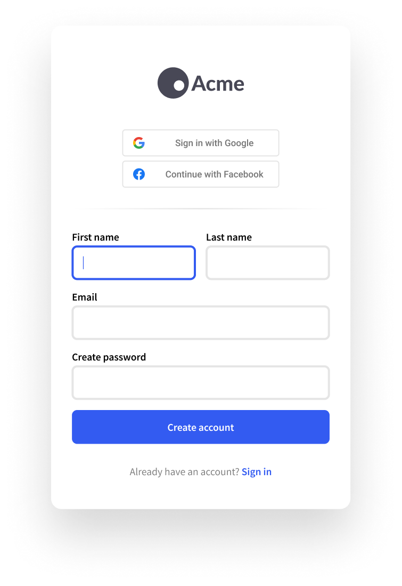

# \<SignUp />

## Overview

The `<SignUp/>` component is used to render a beautiful, high-conversion sign-up flow with your choice of required fields and social sign-up providers. It supports any authentication scheme, from basic [Email/password authentication](broken-reference), to [Passwordless](broken-reference) and [Social Login (OAuth)](broken-reference) and it automatically handles everything for you, from basic data collection to email address and phone number verification.



The `<SignUp/>` component is extremely flexible. Simply configure the [User Management](broken-reference) settings of your instance according to your business requirements and the `<SignUp/>` .

Control the look and feel of the `<SignUp/>` component and match it to your using the [Theme Settings](broken-reference), [theming props](sign-up.md#customization) or [plain CSS](sign-up.md#customization).

## Usage


Make sure you've followed the installation guide for [Clerk React](../../reference/clerk-react/installation.md) or [ClerkJS](../../reference/clerkjs/installation.md) before running the snippets below.


### Mounting in your app

Once you set up the desired functionality and look and feel for the `<SignIn/>` component, all that's left is to render it inside your page. The default rendering is simple but powerful enough to cover most use-cases. The authentication and display (look and feel) configuration that you've set up in your [Clerk Dashboard](https://dashboard.clerk.dev/last-active) will work out of the box.



```jsx
import { ClerkProvider, SignUp } from '@clerk/clerk-react';

function MySignUpPage() {
  // Render the SignUp component
  // somewhere in your app
  return <SignUp />;
}

function App() {
  return (
    // Your app needs to be wrapped with ClerkProvider
    <ClerkProvider frontendApi={"[your-frontend-api]"}>
      <MySignUpPage />
    </ClerkProvider>
  );
}

export default App;
```



```markup
<html>
<body>
    <div id="sign-up"></div>
    
    <script>
        const el = document.getElementById("sign-up");
        // Mount the pre-built Clerk SignUp component
        // in an HTMLElement on your page. 
        window.Clerk.mountSignUp(el);
    </script>
</body>
</html>
```



### Using path-based routing

The mounted `<SignUp/>` component uses hash-based routing by default: as the user goes through the sign up flow, hash portion of the URL will update to reflect the current step (eg: `example.com/#/verify-email`).

With additional configuration, the mounted component can use path-based routing instead (eg: `example.com/sign-up/verify-email`):

1. If using Clerk React, ensure your **ClerkProvider** component has [its **navigate** prop](../../reference/clerk-react/installation.md#4-the-navigate-prop) configured.
2. Add the **path** and **routing** props to your **SignUp** component. Set **path** to the path where the component renders


When using path-based routing, the `<SignUp/>` component must render on `path` and all of it's subpaths:

* For NextJS, use an [optional catch-all route](https://nextjs.org/docs/routing/dynamic-routes#optional-catch-all-routes) like `pages/sign-up/[[...index]].js`
* For React Router, use a [wildcard path](https://reactrouter.com/web/api/Route/path-string-string) like `/sign-up(/?.*)` or simply `/sign-up`




```jsx
import { ClerkProvider, SignUp } from '@clerk/clerk-react';
import { useNavigate } from 'react-router-dom';

function App() {
  // Get the navigate method from
  // the router your app is using. For this
  // example we will use 'react-router-dom'
  const navigate = useNavigate();

  return (
    // Pass the push method to ClerkProvider
    <ClerkProvider 
        frontendApi={"[your-frontend-api]"} 
        navigate={to => navigate(to)}
    >
      <Switch>
        // Declare a /sign-up route
        <Route path='/sign-up'>
          // Finally, mount the SignUp component under "/sign-up" 🎉
          // Don't forget to set the "routing" and "path" props
          <SignUp routing='path' path='/sign-up' />
        </Route>
      </Switch>
    </ClerkProvider>
  );
}

export default App;
```



```jsx
// In _app.js:
// Your usual NextJS root component, wrapped by ClerkProvider
import '../styles/globals.css';
import { ClerkProvider } from '@clerk/clerk-react';
import { useRouter } from 'next/router';

function MyApp({ Component, pageProps }) {
  // Get the navigate/push method from
  // the NextJS router
  const { push } = useRouter();

  return (
    // Pass the push method to ClerkProvider
    <ClerkProvider 
        frontendApi={clerkFrontendApi} 
        navigate={to => push(to)}
    >
      <Component {...pageProps} />
    </ClerkProvider>
  );
}

export default MyApp;


// In pages/sign-up/[[..index]].tsx
// This is your catch all route that renders the SignUp component
import { SignUp } from '@clerk/clerk-react';

export default function SignUpPage() {
  // Finally, mount the SignUp component under "/sign-up" 🎉
  // Don't forget to set the "routing" and "path" props
  return <SignUp routing='path' path='/sign-up' />;
}
```



```markup
<html>
<body>
    <div id="sign-up"></div>
    
    <script>
        const el = document.getElementById("sign-up");
        // Mount the pre-built Clerk SignUp component
        // in an HTMLElement on your page. 
        window.Clerk.mountSignUp(el, {
            routing: 'path',
            path: '/sign-up',
        });
    </script>
</body>
</html>
```



For more information, see [Routing](https://github.com/clerkinc/docs/blob/2.0.0/components/sign-up/broken-reference/README.md).

### Presenting as a modal

The `<SignUp/>` component can also be presented as a modal. This is typically used on pages that show content whether or not the user is signed in.



```jsx
import { useClerk } from "@clerk/clerk-react";

const SignUpButton = () => {
  const { openSignUp } = useClerk();
  return <button onClick={openSignUp}>Sign up</button>;
};
```



```markup
<html>
<body>
    <button id="open-sign-up">Open sign up</button>
    <script>
        // Calling the openSignUp method will
        // open the SignUp component as a modal
        // and show the hosted Sign Up page
        const btn = document.getElementById('open-sign-up');
        btn.addEventListener('click', () => {
            window.Clerk.openSignUp();
        });
    </script>
</body>
</html>
```



## Props

| Name                | Description                                                                                                                                                                                                                                                                        |
| ------------------- | ---------------------------------------------------------------------------------------------------------------------------------------------------------------------------------------------------------------------------------------------------------------------------------- |
| **routing?**        | <p><em>RoutingStrategy</em></p><p>The routing strategy for your pages. Supported values are:</p><ul><li><strong>hash:</strong> (default) Hash based routing.</li><li><strong>path</strong>: Path based routing.</li><li><strong>virtual</strong>: Virtual based routing.</li></ul> |
| **path?**           | <p><em>string</em></p><p>The root URL where the component is mounted on.</p>                                                                                                                                                                                                       |
| **redirectUrl?**    | <p><em>string</em></p><p>Full URL or path to navigate after successful sign in or sign up.<br><br>The same as setting <code>afterSignInUrl</code> and <code>afterSignUpUrl</code> to the same value.</p>                                                                           |
| **afterSignUpUrl?** | <p><em>string</em></p><p>The full URL or path to navigate after a successful sign up.</p>                                                                                                                                                                                          |
| **afterSignInUrl?** | <p><em>string</em></p><p>The full URL or path to navigate after a successful sign in.</p>                                                                                                                                                                                          |
| **signInUrl?**      | <p><em>string</em></p><p>Full URL or path to the sign up page. Use this property to provide the target of the "Sign In" link that's rendered at the bottom of the component.</p>                                                                                                   |

## Customization

The `<SignUp/>` component can be highly customized through the Instance settings on the [Theme page](https://dashboard.clerk.dev/last-active?path=customization/theme). This document will be updated soon with all necessary details.
