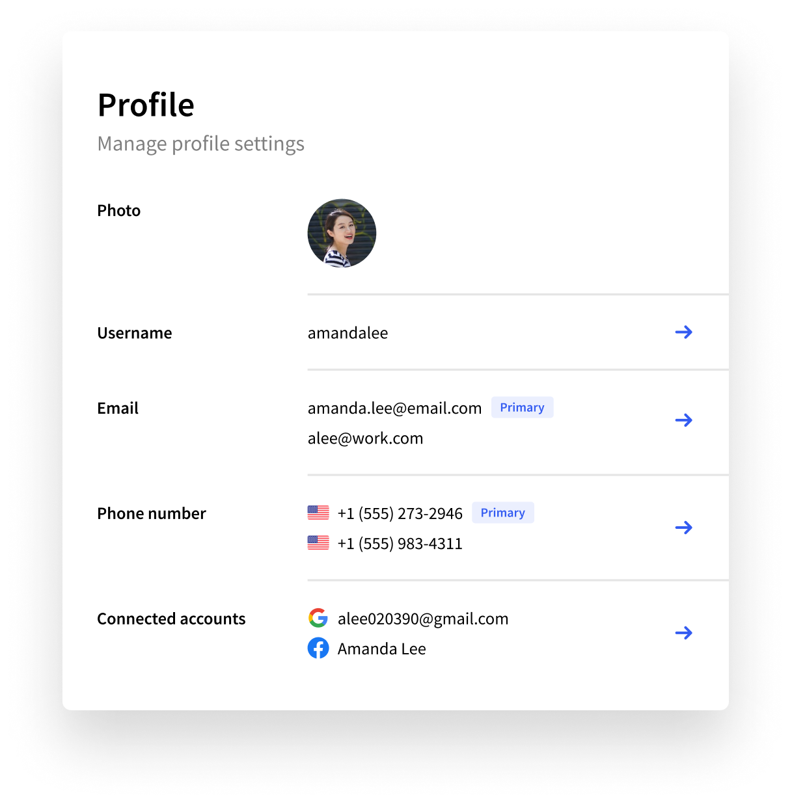

# \<UserProfile />

## Overview

The `<UserProfile/>` component is used to render a beautiful, full-featured account management UI that allows users to manage their profile and security settings.&#x20;



The `<UserProfile/>` comes with built-in support for:

* Name and profile image management
* Email address and phone number management
* Social sign-in account management
* Multi-factor authentication management
* Trusted device management

Control the look and feel of the `<UserProfile/>` component and match it to your using the [Theme Settings](../../popular-guides/setup-your-application.md#theme), [theming props](user-profile.md#customization) or [plain CSS](user-profile.md#customization).

## Usage


Make sure you've followed the installation guide for [Clerk React](../../reference/clerk-react/installation.md) or [ClerkJS](../../reference/clerkjs/installation.md) before running the snippets below.


### Mounting in your app

Once you set up the desired functionality and look and feel for the `<UserProfile/>` component, all that's left is to render it inside your page. The default rendering is simple but powerful enough to cover most use-cases. The  theme configuration (look and feel) that you've set up in your [Clerk Dashboard](https://dashboard.clerk.dev) will work out of the box.



```jsx
import {
  ClerkProvider,
  SignedIn,
  SignedOut,
  UserProfile,
  RedirectToSignIn,
} from "@clerk/clerk-react";
import { useNavigate, BrowserRouter } from "react-router-dom";

function AppWithRoutes() {
  // Get the navigate method from
  // the router your app is using. For this
  // example we will use 'react-router-dom'.
  const navigate = useNavigate();

  return (
    // Pass the navigate method to ClerkProvider
    <ClerkProvider
      frontendApi={"[your-frontend-api]"}
      navigate={(to) => navigate(to)}
    >
    {/* If a user is signed in, they will see
        the user profile, otherwise thet will get
        redirected to the sign in page */}
      <SignedIn>
        <UserProfile />
      </SignedIn>
      <SignedOut>
        <RedirectToSignIn />
      </SignedOut>
    </ClerkProvider>
  );
}

function App() {
  return (
    <BrowserRouter>
      <AppWithRoutes />
    </BrowserRouter>
  );
}

export default App;


```



```markup
<html>
<body>
    <div id="user-profile"></div>
    
    <script>
        const el = document.getElementById("user-profile");
        // Mount the pre-built Clerk UserProfile component
        // in an HTMLElement on your page. 
        window.Clerk.mountUserProfile(el);
    </script>
</body>
</html>
```



### Using path-based routing

The mounted `<UserProfile/>` component uses hash-based routing by default: as the user goes through the different pages, the hash portion of the URL will update to reflect the current page (eg: `example.com/#/account/first-name`).

With additional configuration, the mounted component can use path-based routing instead (eg: `example.com/account/first-name`):

1. If using Clerk React, ensure your **ClerkProvider** component has [its **navigate** prop](../../reference/clerk-react/installation.md#4-the-navigate-prop) configured.
2. Add the **path** and **routing** props to your **UserProfile** component. Set **path** to the path where the component renders


When using path-based routing, the `<UserProfile/>` component must render on `path` and all of it's subpaths:

* For NextJS, use an [optional catch-all route](https://nextjs.org/docs/routing/dynamic-routes#optional-catch-all-routes) like `pages/user/[[...index]].js`
* For React Router, use a [wildcard path](https://reactrouter.com/web/api/Route/path-string-string) like `/user(/?.*)` or simply `/user`




```jsx
import {
  ClerkProvider, SignedIn, SignedOut, 
  UserProfile, RedirectToSignIn,
} from "@clerk/clerk-react";
import {
  useNavigate, Switch, Route,
  BrowserRouter, Link,
} from "react-router-dom";

function AppWithRoutes() {
  // Get the navigate method from
  // the router your app is using. For this
  // example we will use 'react-router-dom'.
  const navigate = useNavigate();

  return (
    // Pass the navigate method to ClerkProvider
    <ClerkProvider
      frontendApi={"[your-frontend-api]"}
      navigate={(to) => navigate(to)}
    >
      <Switch>
    {/* Define a /user route. 
        If a user is signed in, they will see
        the user profile, otherwise thet will get
        redirected to the sign in page */}
        <Route path="/user">
          <SignedIn>
            <UserProfile routing="path" path="/user" />
          </SignedIn>
          <SignedOut>
            <RedirectToSignIn />
          </SignedOut>
        </Route>
        {/* Home route that links to user profile */}
        <Route>
          <Link to="/user">
            <h1>Go to user profile</h1>
          </Link>
        </Route>
      </Switch>
    </ClerkProvider>
  );
}

function App() {
  return (
    <BrowserRouter>
      <AppWithRoutes />
    </BrowserRouter>
  );
}

export default App;

```



```jsx
// In _app.jsx:
// Your usual NextJS root component, wrapped by ClerkProvider
import '../styles/globals.css';
import { ClerkProvider } from '@clerk/clerk-react';
import { useRouter } from 'next/router';

function MyApp({ Component, pageProps }) {
  // Get the navigate/push method from
  // the NextJS router
  const { push } = useRouter();

  return (
    // Pass the push method to ClerkProvider
    <ClerkProvider 
        frontendApi={"[your-frontend-api]"} 
        navigate={to => push(to)}
    >
      <Component {...pageProps} />
    </ClerkProvider>
  );
}

export default MyApp;


// In pages/user/[[..index]].tsx
// This is your catch all route that renders the UserProfile component
import { UserProfile } from '@clerk/clerk-react';

export default function UserProfilePage() {
  // Finally, mount the UserProfile component under "/user" 🎉
  // Don't forget to set the "routing" and "path" props
  return <UserProfile routing='path' path='/user' />;
}

```



```markup
<html>
<body>
    <div id="user-profile"></div>
    
    <script>
        const el = document.getElementById("user-profile");
        // Mount the pre-built Clerk UserProfile component
        // in an HTMLElement on your page. 
        window.Clerk.mountUserProfile(el, {
            routing: 'path',
            path: '/user',
        });
    </script>
</body>
</html>
```



For more information, see [Routing](broken-reference).

## Props

| Name                | Description                                                                                                                                                                                                                                                                        |
| ------------------- | ---------------------------------------------------------------------------------------------------------------------------------------------------------------------------------------------------------------------------------------------------------------------------------- |
| **routing?**        | <p><em>RoutingStrategy</em></p><p>The routing strategy for your pages. Supported values are:</p><ul><li><strong>hash:</strong> (default) Hash based routing.</li><li><strong>path</strong>: Path based routing.</li><li><strong>virtual</strong>: Virtual based routing.</li></ul> |
| **path?**           | <p><em>string</em></p><p>The root URL where the component is mounted on.</p>                                                                                                                                                                                                       |
| **hideNavigation?** | <p><em>boolean</em></p><p>Hides the default navigation bar. Can be used when a custom navigation bar is built.</p>                                                                                                                                                                 |
| **only?**           | <p><em>string</em></p><p>Renders only a specific page of the UserProfile component. Supported values are: </p><ul><li>account: User account page.</li><li>security: User security page.</li></ul>                                                                                  |

## Customization

The `<UserProfile/>` component can be highly customized through the Instance settings in the [Clerk Dashboard](https://dashboard.clerk.dev). This document will be updated soon with all necessary details.
