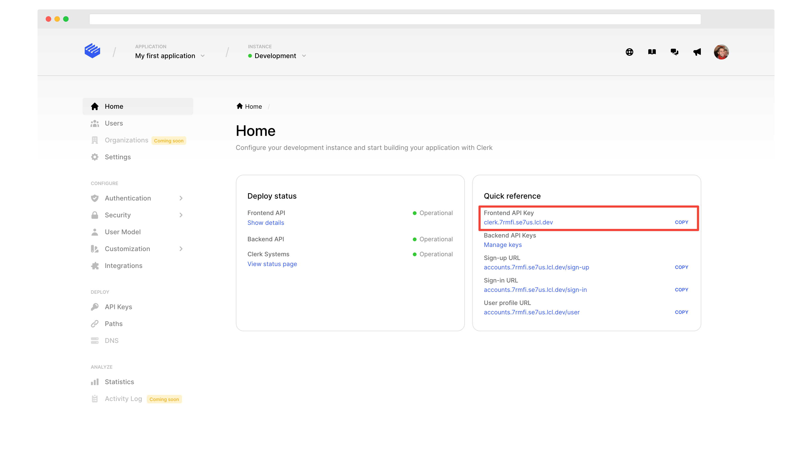
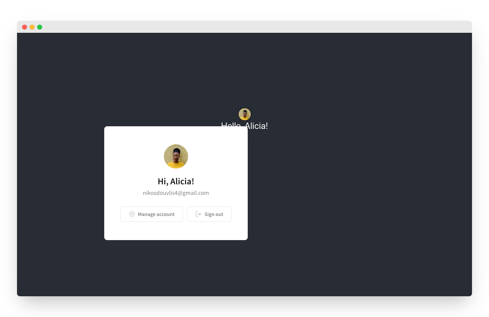

# Get started with React

## Overview

Clerk is the easiest way to add authentication and user management to your React application. This guide will you walk you through the necessary steps to install and use Clerk in a new [create-react-app](https://reactjs.org/docs/create-a-new-react-app.html) application. For more in-depth guides, check out our **Popular Guides** section.

After following this guide, you should have a working React app complete with:&#x20;

* Fully fledged sign in and sign up flows.
* Google Social Login.
* Secure email/password authentication.
* A prebuilt user profile page.

## Before you start

* You need to create a Clerk Application in your [Clerk Dashboard](https://dashboard.clerk.dev). For more information, check out our [Setup your application](../popular-guides/setup-your-application.md) guide.

## Creating a new React app

&#x20; Start by creating a new React application - this is usually done using the [create-react-app](https://reactjs.org/docs/create-a-new-react-app.html) CLI:



```bash
npx create-react-app
```



```
yarn create react-app
```



If you wish to use Typescript, just add `--typescript` to the commands above. Clerk is written in Typescript, so it works out of the box without any extra configuration. For more information, you can reference the [create-react-app documentation](https://github.com/facebook/create-react-app#creating-an-app).

## Installing Clerk

One you have a React app ready, you need to install the Clerk React SDK. This will give you access to our [prebuilt Clerk Components](../main-concepts/clerk-components.md) and React hooks.



```bash
# Navigate to your application's root directory
# This should be the actual name from 
# the previous step
cd my-first-application

# Install the clerk-react package 
npm install @clerk/clerk-react
```



```bash
# Navigate to your application's root directory
# This should be the actual name from 
# the previous step
cd my-first-application

# Install the clerk-react package 
yarn add @clerk/clerk-react
```



Now, we need to set the `CLERK_FRONTEND_API` environment variable. Go to the [Clerk Dashboard](https://dashboard.clerk.dev), select your **Application** and copy the **Frontend API Key** field from the Development instance Home page.



Then, create a file named `.env.local` in your application root. Any variables inside this file with the `REACT_APP_` prefix will be accessible in your React code via `process.env.REACT_APP_VAR_NAME`. Create a `REACT_APP_CLERK_FRONTEND_API` variable and set it to the `Frontend API` you copied earlier:

```bash
# Create the .env.local file
touch .env.local
 
# Add the environment variable. Don't forget to
# replace [your-frontend-api] with the actual Frontend API key
echo "REACT_APP_CLERK_FRONTEND_API=[your-frontend-api]" > .env.local
```

Clerk is now successfully installed! 🎉

To run your app, start the development server and navigate to [http://localhost:3000](http://localhost:3000).



```bash
npm start
```



```bash
yarn start
```



For more details, consult the [Clerk React installation](../reference/clerk-react/installation.md) page.

## Adding \<ClerkProvider />

Clerk requires your application to be wrapped in the `<ClerkProvider/>` context. In React, we add this in `src/App.jsx`.&#x20;

Wrap your app with `<ClerkProvider/>` and pass the `REACT_APP_CLERK_FRONTEND_API` env variable you just created to the `frontendApi` prop. Replace your `src/App.jsx` with:


```jsx
import React from "react";
import "./App.css";
// Import ClerkProvider
import { ClerkProvider } from "@clerk/clerk-react";

// Get the Frontend API from the environment
const frontendApi = process.env.REACT_APP_CLERK_FRONTEND_API;

function App() {
  return (
    // Wrap your entire app with ClerkProvider
    // Don't forget to pass the frontendApi prop
    <ClerkProvider frontendApi={frontendApi}>
      <Hello />
    </ClerkProvider>
  );
}

function Hello() {
  return <div>Hello from Clerk</div>;
}

export default App;
```


Navigate to [http://localhost:3000](http://localhost:3000) to view the changes. Now, let's add a router.

## Adding a router

`<ClerkProvider/>` also accepts a `navigate` prop that enables Clerk to navigate inside your application without a full page reload, using the same routing logic your app does.  Our display components use this prop when navigating between subpages, and when navigating to callback URLs.

You can pass the `navigate` prop a function which takes the destination URL as an argument and performs a "push" navigation. You should not implement the push yourself, but instead wrap the push function provided by your router.&#x20;

Most React apps use the popular [`react-router-dom` router](https://reactrouter.com), which is also what we'll be using for this guide. Install it by running the following command:



```bash
npm i react-router-dom  
```



```
yarn add react-router-dom
```



Wrap your `<App/>` component with the router by modifying the `src/index.jsx`file as shown below:


```jsx
import React from "react";
import ReactDOM from "react-dom";
import "./index.css";
import App from "./App";
import reportWebVitals from "./reportWebVitals";

// Import the BrowserRouter from the react-router-dom package
import { BrowserRouter } from "react-router-dom";

ReactDOM.render(
  <React.StrictMode>
    {/* Wrap your App component with the Router */}
    <BrowserRouter>
      <App />
    </BrowserRouter>
  </React.StrictMode>,
  document.getElementById("root")
);

reportWebVitals();
```


The last step is to give ClerkProvider access to your router, by adding the `navigate` prop. In `src/App.jsx` import and use the `useNavigate` hook, as shown in the example:


```jsx
import React from "react";
import "./App.css";
import { ClerkProvider } from "@clerk/clerk-react";
// import the useNavigate hook
import { useNavigate } from "react-router-dom";

const frontendApi = process.env.REACT_APP_CLERK_FRONTEND_API;

function App() {
  const navigate = useNavigate();

  return (
    //  Pass the push method to the navigate prop
    <ClerkProvider frontendApi={frontendApi} navigate={(to) => navigate(to)}>
      <Hello />
    </ClerkProvider>
  );
}

function Hello() {
  return <div>Hello from Clerk</div>;
}

export default App;
```



The `navigate` function must return the result of the `push` function.


Your app is now configured  🎉    Next, let's see how you can use Clerk to require authentication before navigating to a protected page.

## Requiring authentication <a href="#requiring-authentication" id="requiring-authentication"></a>

The easiest way to require authentication before showing a protected page, is to use our Control Components:

* ​[`<SignedIn/>`](https://docs.clerk.dev/components/control-components/signed-in): Renders its children only when a user is signed in.
* ​[`<SignedOut/>`](https://docs.clerk.dev/components/control-components/signed-out): Renders its children only when there's no active user.
* ​[`<RedirectToSignIn/>`](https://docs.clerk.dev/components/control-components/redirect-to-sign-in): Triggers a redirect to the sign in page.

The following example shows you how to compose our flexible Control Components to build auth flows that match your needs. Please note that you don't need to use any additional APIs, everything shown below is just Javascript.


```jsx
import React from "react";
import "./App.css";
import {
  ClerkProvider,
  SignedIn,
  SignedOut,
  UserButton,
  useUser,
  RedirectToSignIn,
} from "@clerk/clerk-react";
import { useNavigate } from "react-router-dom";

const frontendApi = process.env.REACT_APP_CLERK_FRONTEND_API;

function App() {
  const navigate = useNavigate();

  // If the current route is listed as public, render it directly
  // Otherwise, use Clerk to require authentication
  return (
    <ClerkProvider frontendApi={frontendApi} navigate={(to) => navigate(to)}>
      <SignedIn>
        <Hello />
      </SignedIn>
      <SignedOut>
        <RedirectToSignIn />
      </SignedOut>
    </ClerkProvider>
  );
}

function Hello() {
  return <div>Hello from Clerk</div>;
}

```


Visit [https://localhost:3000](https://localhost:3000) to see your page - you'll immediately get redirected to the Clerk Hosted Sign In page:


## Hello, world!

That's all you need to start using Clerk. Now you can say hello to your user!&#x20;

Let's edit the  `<Hello/>` component. We're going to use the `useUser` hook and the `UserButton` component as shown in the example:


```jsx
import React from "react";
import "./App.css";
import {
  ClerkProvider,
  SignedIn,
  SignedOut,
  UserButton,
  useUser,
  RedirectToSignIn,
} from "@clerk/clerk-react";
import { useNavigate } from "react-router-dom";

const frontendApi = process.env.REACT_APP_CLERK_FRONTEND_API;

function App() {
  const navigate = useNavigate();

  return (
    <ClerkProvider frontendApi={frontendApi} navigate={(to) => navigate(to)}>
      <SignedIn>
        <Hello />
      </SignedIn>
      <SignedOut>
        <RedirectToSignIn />
      </SignedOut>
    </ClerkProvider>
  );
}

function Hello() {
  // Get the user's first name
  const { firstName } = useUser();

  return (
    <div className="App-header">
      {/* Mount the UserButton component */}
      <UserButton />
      <div>Hello, {firstName}!</div>
    </div>
  );
}

export default App;

```


Visit [https://localhost:3000](https://localhost:3000) again to see your page. If you haven't signed in yet, you will be redirected to the sign in page. Sign in using your preferred method and the home page will become accessible:



And that's all!


By default, you app will use the [Clerk Hosted Pages](../main-concepts/clerk-hosted-pages.md) to display the sign in and sign up flows. Check the documentation of the [\<SignIn/>](../components/sign-in/sign-in.md) and [\<SignUp/>](../components/sign-up/sign-up.md) components to learn how you can mount them directly in your app.


## Next steps <a href="#next-steps" id="next-steps"></a>

You now have a working React + Clerk app. Going forwards, you can:

* Learn how to [deploy your app to production](https://docs.clerk.dev/popular-guides/production-setup).
* Check out our in-depth guides for the most usual use cases in the **Popular Guides** section.
* Learn more about the [Clerk Components](https://docs.clerk.dev/main-concepts/clerk-components) and the [Clerk Hosted Pages](https://docs.clerk.dev/main-concepts/clerk-hosted-pages).
* Come say hi in our [discord channel](https://discord.com/invite/b5rXHjAg7A) 👋
