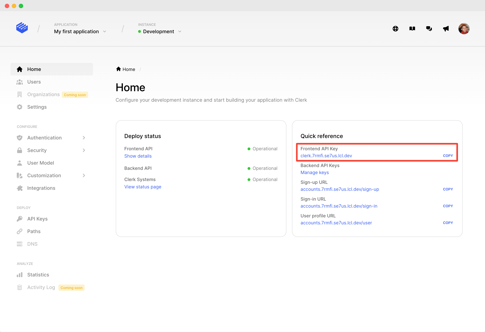

# Get started with Gatsby

## Overview

Clerk is the easiest way to add authentication and user management to your [Gatsby.js](https://www.gatsbyjs.com) application. This guide will walk you through the necessary steps to install and use Clerk in a new [Gatsby.js](https://www.gatsbyjs.com) application.&#x20;

After following this guide, you should have a working [Gatsby.js](https://www.gatsbyjs.com) app complete with:&#x20;

* Fully fledged sign in and sign up flows.
* Google Social Login.
* Secure email/password authentication.
* A prebuilt user profile page.

## Before you start

You need to create a Clerk Application in your [Clerk Dashboard](https://dashboard.clerk.dev). For more information, check out our [Setup your application](../popular-guides/setup-your-application.md) guide.

## Installing Clerk Gatsby Plugin

Once you have a Gatsby.js app ready, you need to install the [Clerk React SDK](../reference/clerk-react/) and [Clerk Gatsby Plugin](https://www.npmjs.com/package/gatsby-plugin-clerk). This will give you access to our [prebuilt Clerk Components](../main-concepts/clerk-components.md) and [React hooks](../reference/clerk-react/).



```bash
# Navigate to your application's root directory
cd your_app

# Install the necessary Clerk packages
npm install gatsby-plugin-clerk @clerk/clerk-react
```



```bash
# Navigate to your application's root directory
cd your_app

# Install the necessary Clerk packages
yarn add gatsby-plugin-clerk @clerk/clerk-react
```



As a next step, we need to set the `CLERK_FRONTEND_API` environment variable. Go to the [Clerk Dashboard](https://dashboard.clerk.dev), select your **Application**, **** copy the **Frontend API Key** field from the Development instance Home page.

Now, let's configure the plugin on `gatsby-config.js.`

For this step, you'll need the `frontendApi` key of your Clerk application. To find it, go to the  [Clerk Dashboard](https://dashboard.clerk.dev), choose the application and the instance you're working on, and locate the key on the **Home** tab.



```bash
// gatsby-config.js

module.exports = {
  plugins: [
    {
      resolve: 'gatsby-plugin-clerk',
      options: {
        frontendApi: <YOUR_FRONTEND_API_KEY>
      }
    }
  ]
}
```

Clerk is now successfully installed   🎉 &#x20;

From here onwards, everything should work just the same. You can start using components like `SignedIn` and `SignedOut` from the root of your app.


```jsx
import React from 'react'
import {
  SignIn,
  SignedIn,
  SignedOut,
  UserButton
  } from '@clerk/clerk-react'

export default function IndexPage() {
  return (
    <>
      <SignedIn>
        <UserButton />
      </SignedIn>
      <SignedOut>
        <SignIn />
      </SignedOut>
    </>
  )
}

```


And that's it, in just a few steps, we added easy and secure authentication with beautiful and complete user management to your Gatsby app. 🎉  &#x20;

## Clerk Gatsby starter

To make it even easier for you, we went ahead and created a [Clerk + Gatsby starter repository](https://github.com/clerkinc/clerk-gatsby-starter). It has Clerk integrated with [Gatsby's default starter](https://github.com/gatsbyjs/gatsby-starter-default).

Inside `src/api` you can also find the new Gatsby Functions in action. We added a couple of examples there, so you know how to use Gatsby's serverless functions with Clerk's backend API.

Fork it, clone it and build it!
