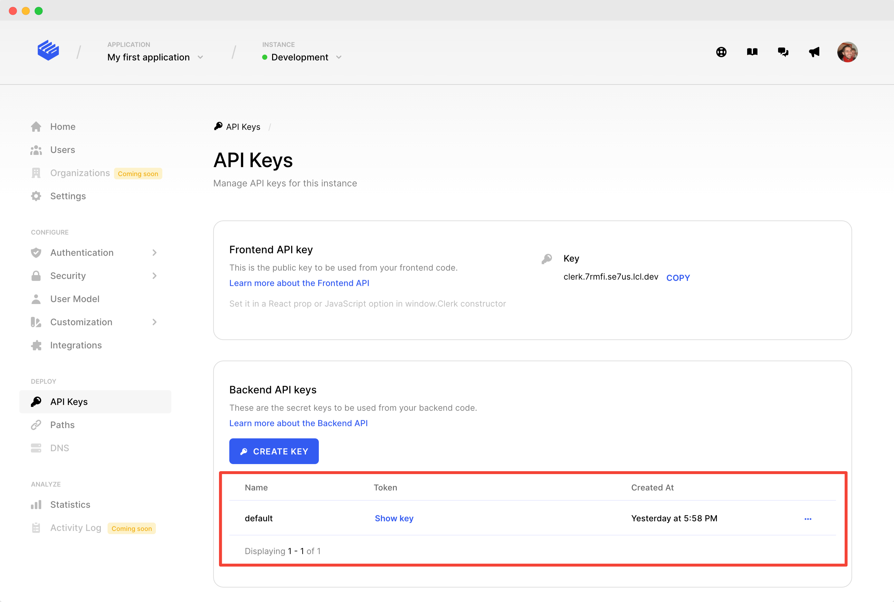

# Get started with Next.js API

## 0. Pre-requirements

This guide assumes you have properly completed your Next.js [frontend setup](nextjs.md).

## 1. Set CLERK\_API\_KEY

Create a file named **.env.local** in your application root if it doesn't exist already. Any variables inside this file will be accessible in your backend with **process.env.VARIABLE\_NAME**.

Get your **CLERK\_API\_KEY** in Dashboard **API Keys** section.




```jsx
CLERK_API_KEY=test_asdf1234
```


## 2. Use the @clerk/nextjs/api

The `@clerk/nextjs` package comes with all the Next.js API methods for using Clerk exported at `@clerk/nextjs/api`.

```typescript
/** Next.js API imports for Clerk. */
import { ... } from "@clerk/nextjs/api";
```

## 3. Create an API route

In Next.js, API routes are created by adding a file to the **pages/api** folder.  The filename is used as the API path. New Next.js applications come with a **pages/api/hello.js** file that we can edit.


```jsx
import { requireSession } from "@clerk/nextjs/api";

export default requireSession((req, res) => {
  res.statusCode = 200;
  res.json({ id: req.session.userId });
});
```


That's it! Now, if a user is signed in, requests to **/api/hello** will return that user's ID.  This ID will never change for this user, so you can use it as a stable user ID in your own codebase.

If a user is signed out, the **requireSession** helper will automatically return with HTTP status 401 and no response body. If you'd prefer to process a request when there is no user, try the **withSession** helper instead:


```jsx
import { withSession } from "@clerk/nextjs/api";

export default withSession((req, res) => {
  res.statusCode = 200;
  if (req.session){
    res.json({ id: req.session.userId });
  } else {
    res.json({ id: null });
  } 
});
```

