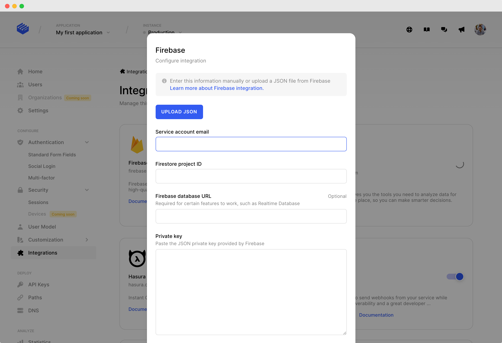

# Firebase

This integration configures Clerk as a [custom authentication system](https://firebase.google.com/docs/auth/web/custom-auth?authuser=0#web-v8) for your Firebase services. It enables Clerk-managed users to authenticate and interact directly with Firebase's suite of tools, including Realtime Database, Cloud Functions, and Cloud Storage.

We have an example application showcasing how to integrate Clerk with Firebase, check it out [https://github.com/clerkinc/clerk-firebase-starter](https://github.com/clerkinc/clerk-firebase-starter).

## 1. Turn on the integration

To enable the integration, you will need to provide Clerk with the required Firebase configuration attributes depending on the Firebase features you would require authenticated user access to.

To get started, turn on the Firebase integration on the [Integrations page](https://dashboard.clerk.dev/last-active?path=integrations).

## 2. Integration configuration

To allow Clerk to generate the required authentication token for Firebase, you will need to set some configuration attributes on the Clerk integration page.

### 2.1 (Easy way) Upload a JSON Firebase configuration file

You can upload the JSON configuration file you will retrieve from Firebase directly on the Firebase integration page, and the required fields will be filled automatically.

* To get the Firebase JSON configuration file, you can follow the step-by-step instructions:


Upload Service Account JSON file on Clerk


* To upload the file on Clerk, use the **Upload JSON** button on the Firebase integration page:



### 2.2 Fill the required attributes manually

The attributes that you need to fill in to connect Clerk with Firebase, as a custom authentication system, are described below:&#x20;

* **Service account ID**\
  ****The service account ID can be found in the [Google Cloud Console](https://console.cloud.google.com/iam-admin/serviceaccounts?consoleUI=FIREBASE\&hl=fi) for your Firebase project, or in the `client_email` field of a service account JSON file.
* **Project ID**\
  ****The Firebase project ID is the unique identifier of your Firebase project. Can be found under the Project Settings in the Firebase platform.
* **Database URL** (_Optional_)\
  ****The Firebase Realtime Database URL as retrieved from the Firebase platform under the **Realtime Database** page.
* **Private Key**\
  ****The private key used for signing which belongs to the Google service account ID of your project.  Can be found in the [Google Cloud Console](https://console.cloud.google.com/iam-admin/serviceaccounts?consoleUI=FIREBASE\&hl=fi) for your Firebase project, or in the `private_key` field of a service account JSON file.

## 3. Firebase user sign-in with Clerk as an authentication provider

After successfully completing the integration setup on your dashboard, you should setup your frontend to connect Clerk with the Firebase authentication system.

### **3.1 Retrieve a Firebase user authentication token from Clerk**

The Firebase Web SDK requires an authentication token to sign-in your users using Clerk. This token can be retrieved calling the `getToken` method of the [User object](../references/javascript/user/user#gettoken) for the Firebase provider.

```javascript
await user.getToken("firebase");
```

The above method will return the token needed for the Firebase Web SDK to sign-in your users with Clerk.

### 3.2 Sign-in using the Firebase Web SDK


&#x20;The Firebase Web SDK referenced, is the browser installation of the Firebase official package on [npm](https://www.npmjs.com/package/firebase).


To authenticate your users on Firebase using Clerk you would need to call the `signInWithCustomToken` method of the Firebase Auth scope.



```javascript
import firebase from "firebase";

await firebase
          .auth()
          .signInWithCustomToken(clerkCustomToken);
```



```javascript
import { getAuth, signInWithCustomToken } from "firebase/auth";

const auth = getAuth();
await signInWithCustomToken(auth, clerkCustomToken);
```



A mostly complete showcase using [@clerk/clerk-react](../reference/clerk-react/installation.md):




```jsx
/** Rest imports */
import firebase from "firebase";
import { useUser } from "@clerk/clerk-react";

function Component(){
    const user = useUser();
    
    /** Example effect */
    useEffect(() => {
        const signInWithClerk = async function(){
            const firebaseClerkToken = await user.getToken("firebase");
            const userCredentials = await firebase
              .auth()
              .signInWithCustomToken(firebaseClerkToken);
            /**  
             * The userCredentials.user object will call the methods of
             * the Firebase platform as an authenticated user.
             */
        }
        
        signInWithClerk();
    }, []);
    
    return <h1>Clerk-Firebase integration!</h1>
}
```



