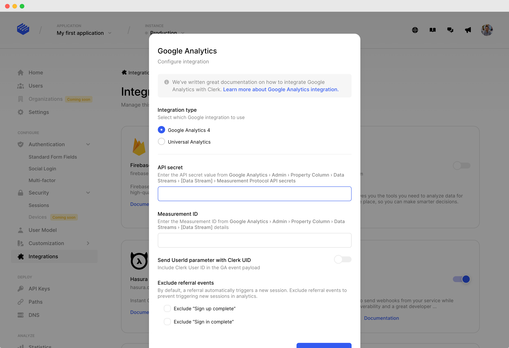

# Google Analytics

This integration enables Clerk to send  user authentication events to the configured Google Analytics property which corresponds to your application.


&#x20;The Google Analytics integration can be enabled only for Production Instances.


## 1. Turn on the integration

To enable the integration, you will need to provide Clerk with the required Google Analytics configuration attributes depending on the type of Google Analytics property. **We support both Universal Analytics and Google Analytics 4 properties.**

To get started, turn on the Google Analytics integration in the [dashboard](https://dashboard.clerk.dev):

**Your Application  and instance → Integrations → Google Analytics**

## 2. Integration configuration

To allow Clerk to report selected events on your Google Analytics property and improve your user analytics quality, you will need to set some configuration attributes on the integration page.

### 2.1 Reporting API credentials

To send events to Google Analytics servers, Clerk uses the [Measurement Protocol](https://developers.google.com/analytics/devguides/collection/protocol/v1) specification. Depending on your property type, you would need to provide the keys as described below:

#### Google Analytics 4&#x20;

* **API Secret**\
  ****An API secret generated in the Google Analytics UI. To create a new secret, navigate to:\
  **Admin → Data Streams → choose your stream → Measurement Protocol → Create**

* **Measurement ID**\
  ****The measurement ID associated with the data stream sending data to your Google Analytics 4 property. The format is _G-XXXXXXX_ and can be found in the Google Analytics UI under:\
  **Admin** **→** **Data Streams** **→** **choose your stream** **→** **Measurement ID**

#### Universal Analytics

* **Tracking ID**\
  ****The tracking ID is a string composed of your account number and the property index and is used to send data to the correct Google Analytics property. The format is _UA-YYYYYY-Z_ and can be found in the Google Analytics UI under:\
  **Admin → Tracking Info → Tracking Code**\
  ****

.png>)

### 2.2 Include Clerk User ID

Since Clerk is used for the user management and authentication in your application, we provide the capability to associate the user identifier generated from Clerk with the User Id feature in Google Analytics. Enabling this feature will allow enhanced user analysis capablities on Google Analytics like cross-device user tracking, session unification and more.

Read more about the User ID feature:\
[Google Analytics 4 User-ID\
](https://support.google.com/analytics/answer/9213390)[Universal Analytics User-ID](https://support.google.com/analytics/answer/3123662?hl=en)

### 2.3 Events to track

Select during which user authentication events such as user sign-in or user sign-up, a Google Analytics event should be recorded.

* **Sign up**\
  ****Sent every time a user signs up for your application through Clerk.\

  * For **Universal Analytics** properties, this is sent as a custom event.\
    The custom event is composed as:\
    Category: _**Clerk**_\
    Action: _**sign\_up**_\
    __Label: **{{signup method}}**\

  * For **Google Analytics 4** properties, this matches the standard [sign\_up event](https://developers.google.com/analytics/devguides/collection/ga4/reference/events#sign\_up). \

* **Sign in**\
  ****Sent every time a user signs in to his account through Clerk.\

  *   &#x20;For **Universal Analytics properties**, this is sent as a custom event.

      Category: _**Clerk**_\
      Action: _**login**_\
      __Label: **{{login method}}**

      ****
  * For **Google Analytics 4** properties, this matches the standard [login event](https://developers.google.com/analytics/devguides/collection/ga4/reference/events#login).

## Frequently Asked Questions

* **Will Clerk events disrupt **_****_** session attribution, user count or other metrics  ?**\
  ****No, Clerk's production architecture allows us to configure the measurement protocol events sent to your property in such a way that session attribution, user count and identification attributes are kept intact. \
  \
  _The only **caveat** in this case is if your authentication domain is regarded as **cross-domain** to the main application domain. If that is the case, feel free to contact us and we will try our best to guide you through a resolution._

