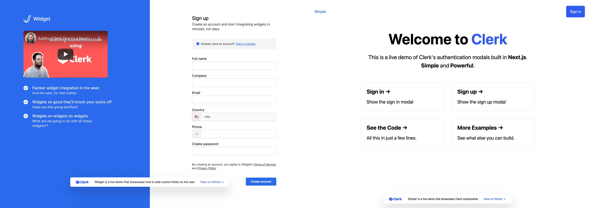

# Build your own UI

## Create a custom sign-up and sign-in page

Clerk provides [sample code](https://github.com/clerkinc/clerk-nextjs-examples) for different types of authentication flows you might need for your application. Each example is a fully runnable application which you can use either as a starter or a guideline on how you can utilize Clerk based on your requirements. In each example folder, you will find instructions on how to bootstrap the application.

### Available repositories

* Clerk Next.js examples: [https://github.com/clerkinc/clerk-nextjs-examples](https://github.com/clerkinc/clerk-nextjs-examples)
* Clerk React examples: [https://github.com/clerkinc/clerk-react-examples](https://github.com/clerkinc/clerk-react-examples)

### Live Demo

* Clerk Acme - [https://nextjs.acme.clerk.app/](https://nextjs.acme.clerk.app)
* Clerk Oasis - [https://nextjs.oasis.clerk.app/](https://nextjs.oasis.clerk.app)
* Clerk Widget - [https://nextjs.widget.clerk.app/](https://nextjs.widget.clerk.app)
* Clerk Simple - [https://nextjs.simple.clerk.app/](https://nextjs.simple.clerk.app)

## Create a custom user profile page

Coming soon...

## Theming customization

To provide a seamless experiences for your authentication flows using [Clerk Components](../main-concepts/clerk-components.md), you can provide a variety of theming options through your application [instance dashboard](setup-your-application.md#theme) or at the code level using Clerk [theming customization](../components/customization.md#overview) options.

