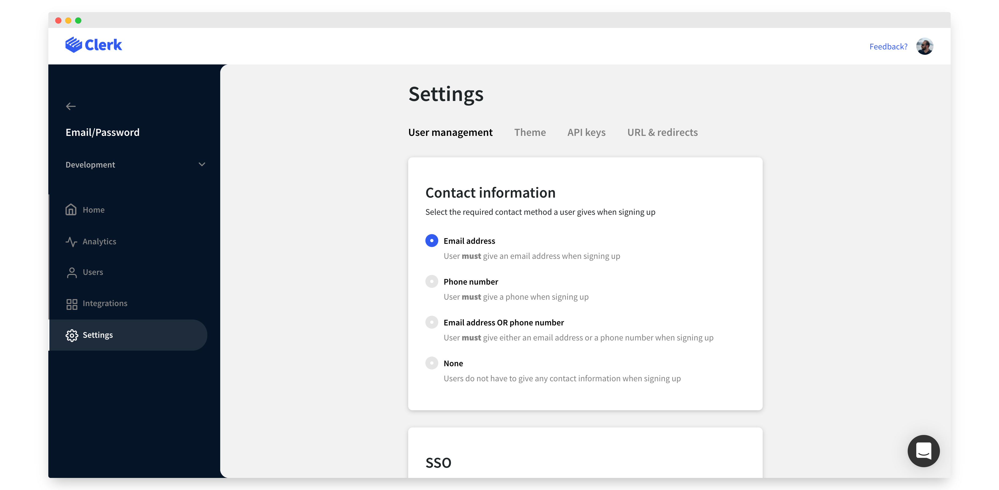
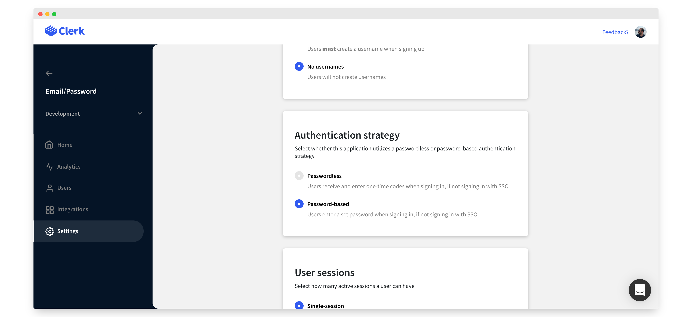
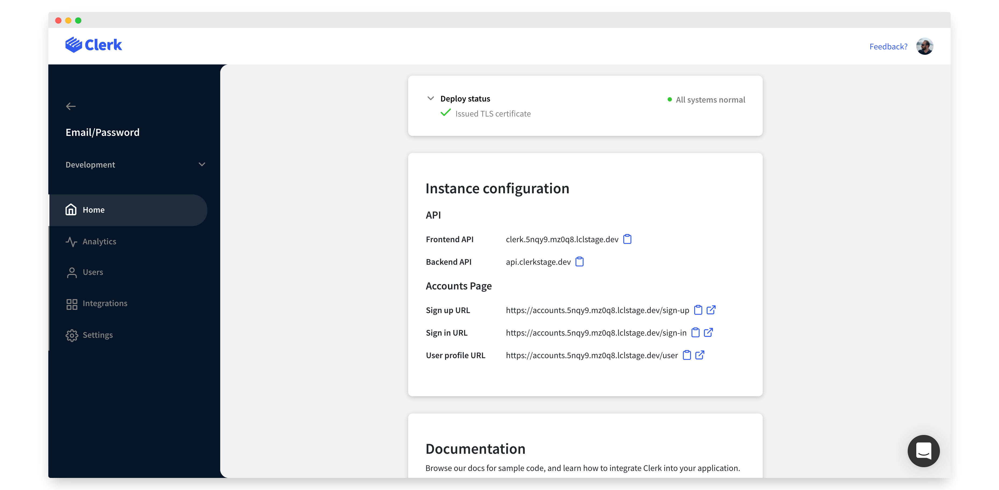

# Email and password

## Overview

One of the most common authentication methods used today is the humble email and password.  With this setup, users that come to your website will need to supply these credentials in order to gain access to their account.

Clerk enforces every user to have a verified email address.  This is done during [sign up](../main-concepts/sign-up-flow.md), by sending a one-time code to the supplied email address.

There are a few different ways to set up an email/password user management system in Clerk.  You can use [Clerk Hosted Pages](email-and-password.md#using-clerk-hosted-pages), [Clerk Components](email-and-password.md#using-clerk-components), or build a completely [custom flow](email-and-password.md#custom-sign-in-and-sign-up) with ClerkJS or Clerk React.

The rest of this guide will explain how to set up an email/password user management system using any of the above methods.


To keep your users safe, Clerk follows a "secure-by-default" policy, and we follow all NIST best practices.  This includes [password validations](../learning-center/security/password-protection.md) out of the box.


## Before you start

* You need to create a Clerk Application in your [Clerk Dashboard](https://dashboard.clerk.dev). For more information, check out our [Setup your application](setup-your-application.md) guide.
* You need to install [Clerk React](../reference/clerk-react/) or [ClerkJS](../reference/clerkjs/) to your application.

## Configuration

The first thing you need to do is enable email address and password-based authentication in your Clerk instance.

From the [Clerk Dashboard](https://dashboard.clerk.dev), select your instance and head over to **Settings** > **User Management**.&#x20;

Select **Email address** for your contact information and **Password-based** as your authentication strategy. For more information on the available settings, check out our [Instance settings guide](broken-reference).


Don't forget to click on **Apply changes** at the bottom of the page!







Instead of email address you could also use phone numbers. All you need to do is choose **Phone Number** under contact information.


## Using Clerk Hosted Pages

If you're looking for the fastest way to implement password based authentication, you can leverage [Clerk Hosted Pages](../main-concepts/clerk-hosted-pages.md) for your sign up, sign in, and user profile pages.  You can set these up on your own domain, and match your websites theme with the Clerk Dashboard to create a seamless experience.&#x20;

You can find your instances sign up and sign in links in the **Home** > **Instance configuration** section of your instance in Clerk Dashboard.&#x20;



By default, the URLs for your hosted pages will match the following pattern:

```http
https://accounts.[your-domain].com/sign-in
https://accounts.[your-domain].com/sign-up
https://accounts.[your-domain].com/user
```


For development instances, Clerk will issue you a domain on "lcl.dev".  In production, you'll need to supply your own domain. See [Production setup](production-setup.md) or more information


Clerk provides SDKs to make navigating to these pages easy. &#x20;



```javascript
import { 
  RedirectToSignIn, 
  RedirectToSignUp 
} from "@clerk/clerk-react";

// Rendering the RedirectToSignIn component will 
// cause the browser to navigate to the Sign in 
// URL and show the Sign In Clerk Hosted Page.
function App() {
  return <RedirectToSignIn />;
}

// Rendering the RedirectToSignUp component will 
// cause the browser to navigate to the Sign up 
// URL and show the Sign Up Clerk Hosted Page.
function App() {
  return <RedirectToSignUp />;
}
```



```javascript
// redirectToSignIn will cause the browser to
// visit the Clerk Hosted Pages Sign in URL.
window.Clerk.redirectToSignIn();

// redirectToSignIn will cause the browser to
// visit the Clerk Hosted Pages Sign in URL.        
window.Clerk.redirectToSignIn();
```




Read our detailed [Clerk Hosted Pages guide](../main-concepts/clerk-hosted-pages.md) to learn more.


## Using Clerk Components

If you want more control over the look and feel of your sign in and sign up experience, but you don't want to completely build one from scratch, you can use the pre-built [Clerk Components](../main-concepts/clerk-components.md).

Clerk provides [\<SignIn />](../components/sign-in/sign-in.md),  [\<SignUp />](../components/sign-up/sign-up.md) and [\<UserProfile />](../components/user-profile/user-profile.md) components that render entire flows. Using these, Clerk will take care of everything from verifying the user's email address to letting your user add 2FA.  Each of these components is also completely customizable via CSS.



```javascript
import { SignUp } from "@clerk/clerk-react";

// SignUpPage is your custom sign-up page component.
function SignUpPage() {
  return (
    <SignUp />
  );
}

```



```markup
<html>
<body>
    <div id="sign-up"></div>
    
    <script>
        const el = document.getElementById("sign-up");
        // Mount the pre-built Clerk SignUp component
        // in an HTMLElement on your page. 
        window.Clerk.mountSignUp(el);
        
        // Render the SignUp component as a 
        // modal on the page.
        window.Clerk.openSignUp();
    </script>
</body>
</html>
```



In the same fashion, there is a [\<SignIn />](../components/sign-in/sign-in.md) component which renders a sign-in form which takes care of authenticating users and creating sessions.



```javascript
import { SignIn } from "@clerk/clerk-react";

// SignInPage is your custom sign-in page component.
function SignInPage() {
  return (
    <SignIn />
  );
}
```



```markup
<html>
<body>
    <div id="sign-in"></div>
    
    <script>
        const el = document.getElementById("sign-in");
        // Mount the pre-built Clerk SignIn component
        // in an HTMLElement on your page. 
        window.Clerk.mountSignIn(el);
        
        // Render the SignIn component as a 
        // modal on the page.
        window.Clerk.openSignIn();
    </script>
</body>
</html>
```



Note that you don't need to pass any special options to the SignUp and SignIn components. Email/password authentication will just work, since it has already been configured through the Clerk dashboard.

For more details on the available component options as well as how you can customize them, please visit the [\<SignUp />](../components/sign-up/sign-up.md) and [\<SignIn />](../components/sign-in/sign-in.md) component guides.

## Custom flow

In case one of the above integration methods doesn't cover your needs, you can leverage Clerk's APIs to create a completely custom email/password sign in and sign up flow.

You will still need to configure your instance for email/password authentication as described at [the top of this guide](email-and-password.md#configuration).

### Sign up

The email/password sign-up flow requires users to provide their email address and their password and returns a newly-created user with an active session. The important thing to note here is that a user's email address needs to be verified before the registration is completed.

A successful sign-up consists of the following steps:

1. Initiate the sign-up process, by collecting the user's email address and password.
2. Prepare the email address verification, which basically sends a one-time code to the given address.
3. Attempt to complete the email address verification by supplying the one-time code.

Let's see the above in action. If you want to learn more about sign-ups, check out our documentation on Clerk's [Sign up flow](../main-concepts/sign-up-flow.md).



```javascript
import { useSignUp } from "@clerk/clerk-react";

const signUp = useSignUp();

// Create a new sign-up with the supplied email and password.
signUp.create({
  emailAddress,
  password
});

// Prepare the verification process for the email address.
// This method will send a one-time code to the email address supplied to 
// the current sign-up.
await signUp.prepareEmailAddressVerification();

// Attempt to verify the email address by supplying the one-time code that 
// was sent in the previous step.
const response = signUp.attemptEmailAddressVerification({
  code: oneTimeCode
});
```



```javascript
const { client } = window.Clerk;

// Create a new sign-up with the supplied email and password.
const signUp = await client.signUp.create({
  emailAddress,
  password
});

// Prepare the verification process for the email address.
// This method will send a one-time code to the email address supplied to 
// the current sign-up.
await signUp.prepareEmailAddressVerification();

// Attempt to verify the email address by supplying the one-time code that 
// was sent in the previous step.
const response = signUp.attemptEmailAddressVerification({
  code: oneTimeCode
});
```



### Sign in

In email/password authentication, the sign in  is a process which requires users to provide their email address and their password and authenticates them by creating a new session for the user.



```javascript
import { useSignIn, useClerk } from "@clerk/clerk-react";

const signIn = useSignIn();
const { setSession } = useClerk();

// Supply the email address and the password to sign in `create`.
// If the combination is correct, the response would include the newly-created 
// session.
const response = await signIn.create({
  identifier: emailAddress,
  password
});
  
// Set the newly-created session as the active session of the Clerk object
setSession(....);
```



```javascript
const { client } = window.Clerk;

// Supply the email address and the password to sign-in `create`.
// If the combination is correct, the response would include the newly-created 
// session.
const response = await client.signIn.create({
  identifier: emailAddress,
  password
});
  
// Set the newly-created session as the active session of the Clerk object
window.Clerk.setSession(....);
```



Note that both the sign in and the sign up flows are extremely flexible and can cover even the most complicated authentication flows. &#x20;

If you want to build custom authentication flows, you should start with Clerk's [sign in ](../main-concepts/sign-in-flow.md)and [sign up](../main-concepts/sign-up-flow.md) flows, and then check out the [ClerkJS](../reference/clerkjs/) or [Clerk React](../reference/clerk-react/) reference docs.


While this guide describes an email/password flow, most of this is relevant to all of the authentication strategies Clerk offers.  To learn about all possible setups, checkout [Setup your application](setup-your-application.md) for more information.

