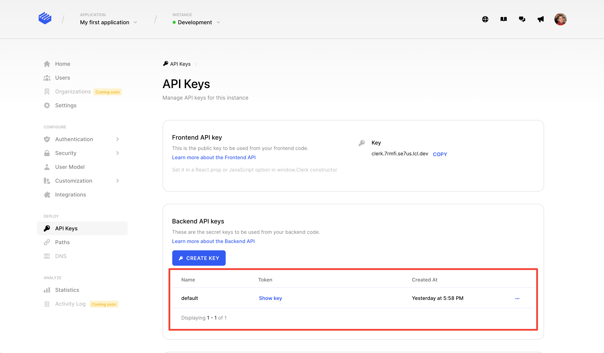

# Invitations

## Overview

Clerk makes it easy to invite users to your application via the invitations feature. This feature is offered by default to all Clerk applications without any extra configuration.

All that is needed to do is to create an invitation for an email address. Once the invitation is created, an email with an invitation link will be sent to the user's email address. By clicking on the invitation link, the user will be redirected to the application's sign up page and their email address will have been automatically verified. At this point, the user will just have to fill in the rest of the details according to the [application's settings](setup-your-application.md#user-management).

Invitations expire after a month. If the user clicks on an expired invitation, they will get redirected to the application's sign up page but they will still have to go via the normal sign up flow, i.e. their email address will not be auto-verified.


Invitations are only used to invite users to your application. The application will still be available to everyone even without an invitation.

If you're looking into creating invitation-only applications, please refer to our [allowlist feature](../reference/backend-api-reference/beta-features/allowlist-identifiers.md).


## Before you start

* You need to create a Clerk Application in your [Clerk Dashboard](https://dashboard.clerk.dev). For more information, check out our [Setup your application](setup-your-application.md) guide.

## Creating invitations

At the moment, you can only create invitations for email addresses via the Backend API. First, you will need to grab your API key which can be found in Clerk Dashboard under **API Keys** > **Backend API  Keys**.



Once you have that, you can make the following request to the Backend API:

```bash
curl https://api.clerk.dev/v1/invitations -X POST -d '{"email_address": "email@example.com"}' -H "Authorization:Bearer $YOUR_API_KEY" -H 'Content-Type:application/json'
```

This will create a new invitation and send an invitation email to the given email address.

## Revoking invitations

Revoking an invitation prevents the user from using the invitation link that was sent to them. In order to revoke an invitation, you can make the following request to the Backend API:

```bash
curl https://api.clerk.dev/v1/invitations/<invitation_id>/revoke -X POST -H "Authorization:Bearer $YOUR_API_KEY" -H 'Content-Type:application/json'
```

The invitation id can be found in the response of the invitation creation request.


Revoking an invitation does **not** prevent the user from signing up on their own.

If you're looking for invitation-only applications, please refer to our [allowlist feature](../reference/backend-api-reference/beta-features/allowlist-identifiers.md).


## Custom flow

If you're using [Clerk Hosted Pages](../main-concepts/clerk-hosted-pages.md) or [Clerk Components](broken-reference), invitation links are handled out of the box. However, if you have built custom sign up and sign in flows using [ClerkJS](../reference/clerkjs/) directly, then you'll need to do a little bit of extra work.

The first thing that changes in this case is that during the invitation creation, you will need to specify the url of your sign up page. You can do that by including an additional `redirect_url` parameter in the invitation creation request.

```bash
curl https://api.clerk.dev/v1/invitations -X POST -d '{"email_address": "email@example.com", "redirect_url": "https://www.example.com/my-sign-up"}' -H "Authorization:Bearer $YOUR_API_KEY" -H 'Content-Type:application/json'
```

This `redirect_url` basically tells Clerk where to redirect the user when they click on the invitation link. This redirection will include an invitation token, something like the following:

```url
https://www.example.com/my-sign-up?__clerk_invitation_token=.....
```

The second and final thing you'll need to do is to pass this token into the sign up `create` call, when starting the sign up flow.



```javascript
import { useSignUp } from "@clerk/clerk-react";

const signUp = useSignUp();

// Get the token from the query parameter
const param = '__clerk_invitation_token';
const invitationToken = const val = new URL(window.location.href).searchParams.get(param);

// Create a new sign-up with the supplied invitation token.
// You can also include any additional information required 
// based on your application configuration. Or, you can add 
// them later using the `signUp.update` method.
// After the below call, the user's email address will be 
// verified because of the invitation token.
const response = await signUp.create({
  invitationToken,
  firstName,
  lastName
});
```



```javascript
const { client } = window.Clerk;

// Get the token from the query parameter
const param = '__clerk_invitation_token';
const invitationToken = const val = new URL(window.location.href).searchParams.get(param);

// Create a new sign-up with the supplied invitation token.
// You can also include any additional information required 
// based on your application configuration. Or, you can add 
// them later using the `signUp.update` method.
// After the below call, the user's email address will be 
// verified because of the invitation token.
const signUp = await client.signUp.create({
  invitationToken,
  firstName,
  lastName
});
```


