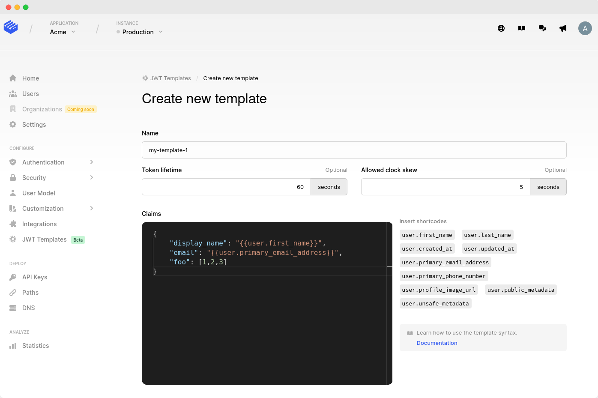

# JWT Templates

## Introduction

Clerk offers the ability to generate [JSON Web Tokens](https://en.wikipedia.org/wiki/JSON\_Web\_Token) (JWTs) representing users that are signed in to your application.

JWT Templates is a powerful feature that extends this functionality by allowing you to _customize_ the contents of these tokens. This enables you to integrate with any third-party services that support authentication with JWTs.

## Overview

JWTs can be generated from your frontend using Clerk.js. Each token depicts a user who is authenticated to your application. Tokens can only be generated for signed in users and each token is _tied to a particular user_.

Tokens are cryptographically signed with your instance's private key and can be verified using its public key, which can be fetched from your instance's JWKS endpoint, typically `https://clerk.your-site.com/.well-known/jwks.json`.

With JWT Templates you can control the claims that will go into these tokens, by defining custom templates that fit your needs. An example use case is integrating with a third-party service that is able to consume JWTs, but requires them to be in a particular format.

At a glance, the process for creating and using a template is the following:

1. Create a template from Dashboard
2. From your frontend, generate tokens using that template

In the following sections we will dive into these steps and learn what we can achieve with JWT Templates. Finally, we will see a complete example of a template and its resulting tokens.

## Template basics

Templates are essentially JSON objects that specify claims to be included in the generated tokens, along with their respective values.

Claim values can be either _static_ or _dynamic_. Static values can be any of the regular JSON data types (strings, numbers, booleans, arrays, objects, null) and will be included as-is in the tokens. Dynamic values, also called _shortcodes,_ are special _strings_ that will be substituted for their actual values when the tokens are generated.

Example of a template that specifies both static values and shortcodes:

```json
{
    "aud": "https://example.com",
    "interests": ["hiking", "knitting"],
    "name": "{{user.first_name}}",
    "surname": "{{user.last_name}}",
    "email": "{{user.primary_email_address}}"
}
```

In this example, the values of the `aud` and `interests` claims are static. The values of the `name` and `email` claims are dynamic. __&#x20;

A token generated using the template above, would look roughly like this:

```json
{
    "aud": "https://example.com",
    "interests": ["hiking", "knitting"],
    "name": "John",
    "surname": null,
    "email": "john@doe.org"
    // ...plus some automatically-included claims; more on that below
}
```

### Default claims

In the previous example we glanced over something called "automatically-included claims". Besides the claims specified by the template, there are certain claims that are _automatically included_ in all tokens and cannot be overridden by templates. We call them _default claims_ and they are the following:

* `sub`: The user's unique ID (e.g. `"user_abc1234def57"`)
* `iat`: The time at which the token was issued, as a Unix timestamp (e.g. `1516239022`)
* `iss`: The Frontend API URL of your instance (e.g. `"https://clerk.your-site.com"`)
* `jti`: A random alphanumeric string, used as a unique identifier for the token
* `exp`: The time after which the token will expire, as a Unix timestamp. Determined using the _"Token lifetime"_ template setting.
* `nbf`: The time before which the token is considered invalid, as a Unix timestamp.  Determined using the _"Allowed Clock Skew"_ template setting.
* `azp`: The Origin of the request. If it's not present, this claim is omitted.

These are all standard claims registered by IANA. For generic information about them refer to [RFC 7519](https://datatracker.ietf.org/doc/html/rfc7519#section-4.1).

### Shortcodes

To include dynamic data in a token, you can use shortcodes - special _strings_ that are substituted for their corresponding values during token generation. Shortcodes are typically used to refer to data that depend on the currently authenticated user.

Shortcodes are strings of the form `"{{some.identifier}}"` and they can be used in place of  values (but not keys).

The available shortcodes are the following:

<table><thead><tr><th>Shortcode</th><th>Description</th><th data-type="select" data-multiple>Type</th><th>Example</th></tr></thead><tbody><tr><td><code>"{{user.id}}"</code></td><td>The user's unique identifier in Clerk</td><td></td><td><code>"user_abc123bcde"</code></td></tr><tr><td><code>"{{user.first_name}}"</code></td><td>The user's first name, if provided.</td><td></td><td><code>"John"</code></td></tr><tr><td><code>"{{user.last_name}}"</code></td><td>The user's last name, if provided.</td><td></td><td><code>"Doe"</code></td></tr><tr><td><code>"{{user.external_id}}"</code></td><td>The user's external ID, as provided to the <a href="https://docs.clerk.dev/reference/backend-api-reference/users#create-a-user">Create User endpoint</a>.</td><td></td><td><code>"abcdef1234"</code></td></tr><tr><td><code>"{{user.created_at}}"</code></td><td>Date and time when the user has signed up to the instance, as a Unix timestamp.</td><td></td><td><code>1640104791</code></td></tr><tr><td><code>"{{user.updated_at}}"</code></td><td>Date and time when the user was last updated, as a Unix timestamp.</td><td></td><td><code>1640104748</code></td></tr><tr><td><code>"{{user.primary_email_address}}"</code></td><td>The user's primary email, if provided.</td><td></td><td><code>"john@example.com"</code></td></tr><tr><td><code>"{{user.primary_phone_number}}"</code></td><td>The user's primary phone, if provided.</td><td></td><td><code>"+12025550188"</code></td></tr><tr><td><code>"{{user.profile_image_url}}"</code></td><td>The user's avatar image URL. If not provided, the default avatar is used.</td><td></td><td><code>"https://www.gravatar.com/avatar?d=mp"</code></td></tr><tr><td><code>"{{user.public_metadata}}"</code></td><td>The user's <a href="https://docs.clerk.dev/main-concepts/user-object#custom-user-metadata">public metadata</a> object. To retrieve specific attributes, see "User metadata".</td><td></td><td><code>{"interests": ["hiking", "knitting"] }</code></td></tr><tr><td><code>"{{user.unsafe_metadata}}"</code></td><td>The user's <a href="https://docs.clerk.dev/main-concepts/user-object#custom-user-metadata">unsafe metadata</a> object. To retrieve specific attributes, see "User metadata".</td><td></td><td><code>{}</code></td></tr></tbody></table>

If you need something that is missing from this list, please do not hesitate to [contact us](mailto:support@clerk.dev).


Even though in templates shortcodes are string values, their type in the generated token depends on the original type of the information that's included. For example, `"{{user.public_metadata}}"` will be substituted for a JSON _object_, not a string.


#### User metadata <a href="#usermetadata" id="usermetadata"></a>

While you can use `"{{user.public_metadata}}"` or `"{{user.unsafe_metadata}}"` to include the complete [metadata](https://docs.clerk.dev/main-concepts/user-object#custom-user-metadata) object in the final token, there might be cases where you only need  a specific piece of information.

To keep your tokens lean, there is a syntax you can use to do just that.

Let's assume the user's public metadata are the following:

```json
{
  "interests": ["hiking", "knitting"],
  "addresses": {
    "Home": "2355 Pointe Lane, 56301 Minnesota",
    "Work": "3759 Newton Street, 33487 Florida"
}
```

To access the `interests` array, you would use the shortcode `"{{user.public_metadata.interests}}"`. To access the _Home_ address, you would use `"{{user.public_metadata.addresses.Home}}"`.

An example follows:

```json
// template
{
  "likes_to_do": "{{user.public_metadata.interests}}",
  "shipping_address": "{{user.public_metadata.addresses.Home}}"
}

// actual token
{
  "likes_to_do": ["hiking", "knitting"],
  "shipping_address": "2355 Pointe Lane, 56301 Minnesota"
}
```

Using the same notation (`.`) you can fetch data from nested fields of arbitrary depth. The examples above use public metadata, but the same notation works for unsafe metadata as well.

Future extensions to the template language may provide more ways to query for specific data. Until then, please [contact us](mailto:support@clerk.dev) if you need something that is not currently supported.

## Creating a template

A template consists of the following (4) properties:

1. **Template name**: a unique identifier for the template. When generating a token, you will have to specify the template to use, using this name. This is a required field.
2. **Token lifetime**: the time in seconds, after which tokens generated with this template will expire. This setting determines the value of the `exp` claim (i.e. `exp=current_time+lifetime`). Default is 60 seconds.
3. **Token allowed clock skew**: the time in seconds, provided as a leeway to account for clock skews between different servers. This setting determines the value of the `nbf` claim (i.e. `nbf=current_time-allowed_clock_skew`). Default is 5 seconds.
4. **Claims:** the actual template that's entered into the JSON editor (see screenshot). A template is essentially a JSON object that describes what the final token claims will look like (shortcodes can be used here). This is a required field.

Templates can be created from Dashboard by navigating to your instance's settings and clicking the **JWT Templates** option.



## Using a template

Tokens are generated by your frontend via Clerk.js, by specifying the template to use.

Assuming you named your template `my-template-1`, you can generate a token using that template, like so:

```javascript
try {
  await Clerk.session.getToken({ template: 'my-template-1' }) // => "eyJhbGciOiJSUzI1NiIsImtpZC..."
} catch(e) {
    // handle error
}
```

The return value is a Promise, since this code will query the Frontend API (`clerk.your-site.com`) to generate the JWT and fetch it, encoded in Base64.


Tokens can only be generated if the current user is signed in


## Complete example

A more detailed example follows, which demonstrates the full capabilities of JWT Templates, including static claim values, dynamic claim values via shortcodes and automatically included claims.

Given the following user:

* First name: `Maria`
* Profile picture URL: `https://example.com/avatar.jpg`
* Clerk ID: `user_abcdef123456789`
* Email address (verified): `maria@example.com`
* Phone number: (not provided)&#x20;
* Public metadata: `{ "profile" : {"interests": ["reading", "climbing"] } }`
* Unsafe metadata: `{ "foo" : { "bar": 42 } }`&#x20;

And given the following template (comments added here for clarity):

```json
{
    // static values
    "aud": "https://my-site.com",
    "version": 1,
    "foo": { "bar": [1,2,3] },
    
    // dynamic values
    "user_id": "{{user.id}}",
    "avatar": "{{user.profile_image_url}}",
    "first_name": "{{user.first_name}}",
    "last_name": "{{user.last_name}}",
    "email": "{{user.primary_email_address}}",
    "phone": "{{user.primary_phone_address}}",
    "registration_date": "{{user.created_at}}",
    "likes_to_do": "{{user.public_metadata.profile.interests}}",
    "unsafe_meta": "{{user.unsafe_metadata}}",
    "invalid_shortcode": "{{user.i_dont_exist}}"
}
```

Generating a token using the above template, for the aforementioned user, would result in roughly the following claims:

```json
{
    "aud": "https://my-site.com",
    "version": 1,
    "foo": { "bar": [1,2,3] },
    "user_id": "user_abcdef123456789",
    "avatar": "https://example.com/avatar.jpg",
    "first_name": "Maria",
    "last_name": null,
    "email": "maria@example.com",
    "phone": null,
    "registration_date": 1227618844,
    "likes_to_do": ["reading", "climbing"],
    "unsafe_meta": {
        "foo" : {
            "bar": 42
        }
     },
     "invalid_shortcode": "{{user.i_dont_exist}}",
     
     // default claims, included automatically
    "iat": 1639398272,
    "nbf": 1639398220,
    "jti": "ab293jfirnbmc90qhjwen21",
    "exp": 1639398300,
    "iss": "https://clerk.my-site.com",
    "sub": "user_abcdef123456789"
}
```
