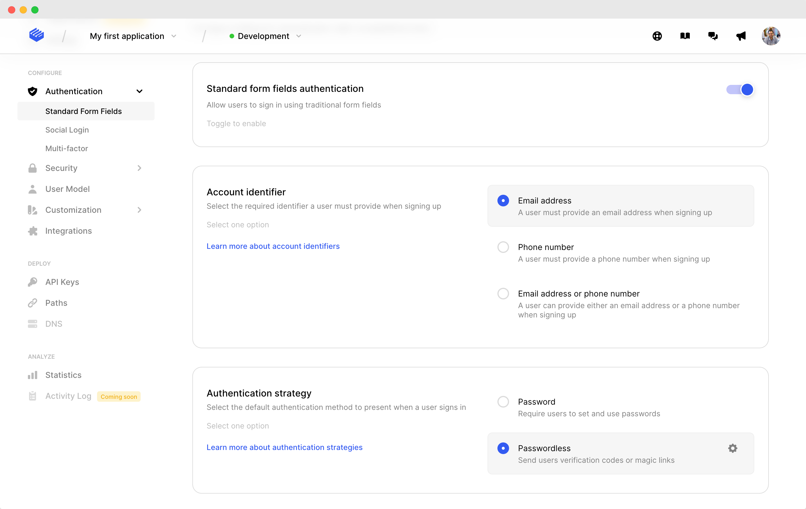
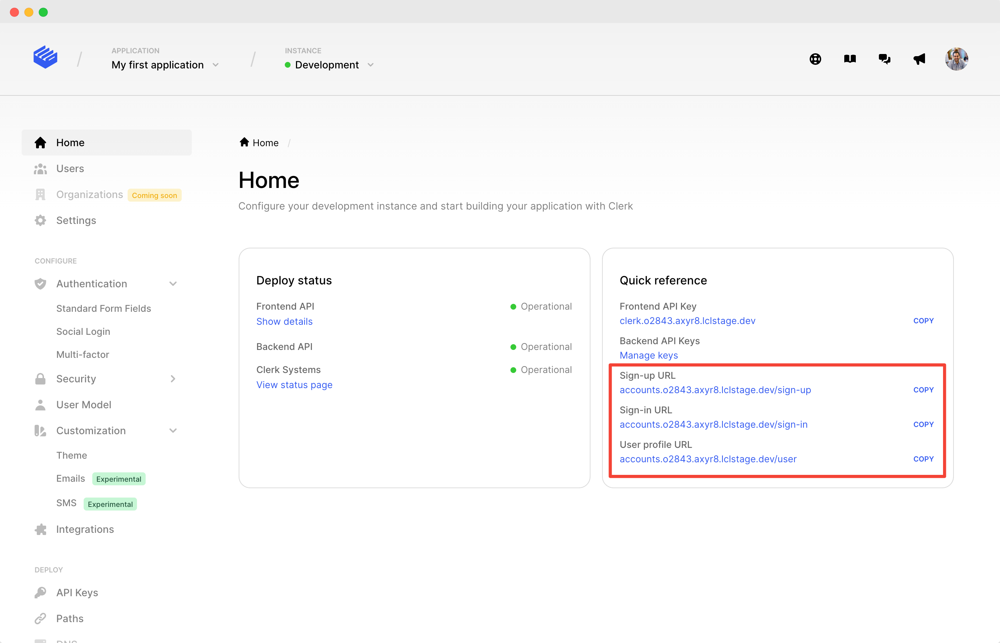

# Magic links

## Overview

Clerk supports passwordless authentication with magic links, which lets users sign in and sign up without having to remember a password. During login or registration, users will be asked to enter their email address to receive an email message with a link that can be clicked and complete the authentication process.

This one-click, link based verification method is often referred to as a "magic link". The process is similar to sending a [one-time code](passwordless-authentication.md) to your users, but skipping the part where they have to come back to your app and enter the code. This is where the "magic" kicks in.

As a form of passwordless authentication, magic links arguably provide greater security and a better user experience than traditional passwords. Since there's less steps involved in every authentication attempt, the user experience is better than one-time codes. However, magic links are not without their downsides, and often still boil down to the email providers "knowledge based factor" instead of yours.

Magic links are the default passwordless authentication strategy when using Clerk. They can be used to [sign up new users](../main-concepts/sign-up-flow.md), [sign in existing ones](../main-concepts/sign-in-flow.md) or allow existing users to verify [newly entered email addresses](../main-concepts/user-object.md#update-user-profiles) to their profile.

Your users will still be able to choose an alternative authentication (or verification) method even after they've clicked the magic link they received in their inbox. Magic links are simply the default authentication method for email address based, passwordless authentication in Clerk.


Looking for one-time code (OTP) authentication? Check out our [One-time code authentication](passwordless-authentication.md) guide.


### Magic link flow

Magic links can be used to easily authenticate users or verify their email addresses. In all the above cases, Clerk will take care of the plumbing and allow you to offer a seamless experience to your users:

1. User enters their email address and asks for a magic link.
2. Your application waits for the verification result.
3. Clerk sends an email to the user, containing a link to the verification URL.
4. User clicks the magic link. This can happen on the same device where they entered their email address, or a different device.&#x20;
5. Clerk will verify the user's identity and advance any sign in or sign up attempt that might be in progress. In case the verification fails, Clerk will inform the user.
6. Your user will now be logged in on the device or tab that they opened the link.

Magic links work on any device. There's no constraint on where the link will be opened. For example, a user might try to sign in from their desktop browser, but open the link from their mobile phone.&#x20;

As an additional security measure, we expire magic links after a while. This way we can guard against cases where a stale link might be compromised. From a user experience perspective, the magic link flow is supposed to be nearly synchronous. Don't worry, your users will have plenty of time to complete the flow before the magic link expires.

Clerk provides a highly flexible API that allows you to hook into any of the above steps, while abstracting away all the complexities of a magic link based authentication or verification flow.&#x20;

We take care of the boring stuff, like efficient polling, secure session management and different device authentication so you can focus on your application code.

## Before you start

* You need to create a Clerk Application in your [Clerk Dashboard](https://dashboard.clerk.dev). For more information, check out our [Setup your application](setup-your-application.md) guide.
* You need to install [Clerk React](../reference/clerk-react/) or [ClerkJS](../reference/clerkjs/) to your application.

## Configuration

Magic link authentication can be configured through the [Clerk Dashboard](https://dashboard.clerk.dev). Go to your instance, then **Authentication > Standard Form Fields.** Simply choose **Passwordless** as the authentication strategy.



Don't forget that you also need to make sure you've configured your application instance to request the user's email address. Users can receive magic links only via email messages. Make sure you select one of the following options;  **Email address** or **Email address OR phone number**.&#x20;


Don't forget to click on the **Apply Changes** button at the bottom of the page once you're done configuring your instance.


That's all you need to do to enable authentication with magic links for your instance. Now let's see how we can make some magic with our configuration.

## Using Clerk Hosted Pages

If you're looking for the fastest way to implement authentication with magic links, you can leverage [Clerk Hosted Pages](../main-concepts/clerk-hosted-pages.md) for your sign up, sign in, and user profile pages. You can set these up on your own domain, and match your website's theme with the Clerk Dashboard to create a seamless experience.&#x20;

You can find your instance's sign up and sign in links in the **Home** section of your instance in Clerk Dashboard.&#x20;



By default, the URLs for your hosted pages will match the following pattern:

```http
https://accounts.[your-domain].com/sign-in
https://accounts.[your-domain].com/sign-up
https://accounts.[your-domain].com/user
```


For development instances, Clerk will issue you a domain on "lcl.dev".  In production, you'll need to supply your own domain. See [Production setup](production-setup.md) or more information


Clerk provides SDKs to make navigating to these pages easy. &#x20;



```jsx
import { 
  RedirectToSignUp,
  RedirectToSignIn
} from "@clerk/clerk-react";

// Rendering the RedirectToSignOut component will 
// cause the browser to navigate to the Sign up 
// URL and show the Sign Up Clerk Hosted Page.
function App() {
  return <RedirectToSignUp />;
}

// Rendering the RedirectToSignIn component will 
// cause the browser to navigate to the Sign in 
// URL and show the Sign In Clerk Hosted Page.
function App() {
  return <RedirectToSignIn />;
}
```



```javascript
// redirectToSignUp will cause the browser to
// visit the Clerk Hosted Pages Sign up URL.        
window.Clerk.redirectToSignUp();

// redirectToSignIn will cause the browser to
// visit the Clerk Hosted Pages Sign in URL.
window.Clerk.redirectToSignIn();
```




Read our detailed [Clerk Hosted Pages guide](../main-concepts/clerk-hosted-pages.md) to learn more.


## Using Clerk Components

You can leverage [Clerk Components](../main-concepts/clerk-components.md) in order to easily add support for magic link based authentication in your application.

Clerk provides a [\<SignUp />](../components/sign-up/sign-up.md) pre-built component that renders a sign up form to handle user registrations.

Similarly, there's a [\<SignIn />](../components/sign-in/sign-in.md) pre-built component that renders a sign in form and takes care of user authentication and session creation.

On the other hand for adding and verifying email addresses to a user's profile, Clerk offers a customizable [\<UserProfile />](../components/user-profile/user-profile.md) pre-built component.

Note that you don't need to pass any special options to the pre-built **\<SignUp />,** **\<SignIn />** and **\<UserProfile />** components. Magic link authentication/verification will just work, since you already configured it through the Clerk [dashboard](https://dashboard.clerk.dev).

### Sign up <a href="#clerk-components-sign-up" id="clerk-components-sign-up"></a>

Signing users up to your application is as simple as rendering the **\<SignUp />** component.



```jsx
import { SignUp } from "@clerk/nextjs";

// SignUpPage is your custom sign up page component.
function SignUpPage() {
  return (
    // The Clerk SignUp component needs no special 
    // configuration. Passwordless authentication
    // will just work when configured from the 
    // Clerk dashboard.
    <SignUp />
  );
```



```jsx
import { SignUp } from "@clerk/clerk-react";

// SignUpPage is your custom sign up page component.
function SignUpPage() {
  return (
    // The Clerk SignUp component needs no special 
    // configuration. Passwordless authentication
    // will just work when configured from the 
    // Clerk dashboard.
    <SignUp />
  );
}
```



```markup
<html>
<body>
    <div id="sign-up"></div>
    
    <script>
        const signUpEl = document.getElementById("sign-up");
        // Mount the pre-built Clerk SignUp component
        // in an HTMLElement on your page. 
        window.Clerk.mountSignUp(signUpEl);
        
        // Render the SignUp component as a  
        // modal on the page.
        window.Clerk.openSignUp();
    </script>
</body>
```



### Sign in <a href="#clerk-components-sign-in" id="clerk-components-sign-in"></a>

Signing users in with a magic link is as simple as mounting the **\<SignIn />** component.



```jsx
import { SignIn } from "@clerk/nextjs";

// SignInPage is your custom sign in page component.
function SignInPage() {
  return (
    // The Clerk SignIn component needs no special
    // configuration. 
    <SignIn />
  );
}
```



```jsx
import { SignIn } from "@clerk/clerk-react";

// SignInPage is your custom sign in page component.
function SignInPage() {
  return (
    // The Clerk SignIn component needs no special
    // configuration. 
    <SignIn />
  );
}
```



```markup
<html>
<body>
    <div id="sign-in"></div>
    
    <script>
        const signInEl = document.getElementById("sign-in");
        // Mount the pre-built Clerk SignIn component
        // in an HTMLElement on your page. 
        window.Clerk.mountSignIn(signInEl);
        
        // Render the SignIn component as a 
        // modal on the page.
        window.Clerk.openSignIn();
    </script>
</body>
```



### Email address verification

Users can add email addresses through their profile pages and they will be verified via magic links. Simply render the **\<UserProfile />** component.



```jsx
import { UserProfile } from "@clerk/nextjs";

// Profile is your custom user profile page component.
function Profile() {
  return (
    // The Clerk UserProfile component needs no special
    // configuration. 
    <UserProfile />
  );
}
```



```jsx
import { UserProfile } from "@clerk/clerk-react";

// Profile is your custom user profile page component.
function Profile() {
  return (
    // The Clerk UserProfile component needs no special
    // configuration. 
    <UserProfile />
  );
}
```



```markup
<html>
<body>
    <div id="profile"></div>
    
    <script>
        const profileEl = document.getElementById("profile");
        // Mount the pre-built Clerk UserProfile component
        // in an HTMLElement on your page. 
        window.Clerk.mountUserProfile(profileEl);
    </script>
</body>
```




If you're interested in more pre-built offerings, you can read more about [Clerk Components](../main-concepts/clerk-components.md).


## Custom flow

In case one of the above integration methods doesn't cover your needs, you can make use of lower level commands and create a completely custom magic link authentication flow.

You still need to configure your instance in order to enable magic link authentication, as described at the [top of this guide](magic-links.md#configuration).

### Sign up

Registration with magic links follows a set of steps that require users to enter their email address as authentication identifiers and click on a link that's delivered to them via email message.

The sign up process can be completed on the same or a different device. For example, users might enter their email address in their desktop browser, but click the sign up magic link from their mobile phone. The user's email address will still be verified and registration will proceed.

Let's see all the steps involved in more detail.

1. Initiate the sign up process, by collecting the user's identifier. It must be their email address.
2. Start the magic link verification flow. There's two parts to the flow:
   1. Prepare a verification for the email address by sending an email with a magic link to the user.
   2. Wait until the magic link is clicked. This is a polling behavior which can be cancelled at any time.
3. Handle the magic link verification result accordingly. Note that the magic link can be clicked on a different device/browser than the one which initiated the flow.
   1. The verification was successful so you need to continue with the [sign up flow](../main-concepts/sign-up-flow.md).
   2. The verification failed or the magic link has expired.

Clerk provides a highly flexible API that allows you to hook into any of the above steps, while abstracting away all the complexities of a magic link based sign up flow.&#x20;



```jsx
import React from "react";
import { useRouter } from "next/router";
import {
  MagicLinkErrorCode, 
  isMagicLinkError,
  useClerk,
  useSignUp,
  useMagicLink,
} from "@clerk/nextjs";

// pages/sign-up.jsx
// Render the sign up form.
// Collect user's email address and send a magic link with which
// they can sign up.
function SignUp() {
  const [emailAddress, setEmailAddress] = React.useState("");
  const [expired, setExpired] = React.useState(false);
  const [verified, setVerified] = React.useState(false);
  const router = useRouter();
  const { setSession } = useClerk();
  const signUp = useSignUp(); 
   
  const { startMagicLinkFlow } = useMagicLink(signUp);
    
  async function submit(e) {
    e.preventDefault();
    setExpired(false);
    setVerified(false);
    
    // Start the sign up flow, by collecting 
    // the user's email address.
    await signUp.create({ emailAddress });
    
    // Start the magic link flow.
    // Pass your app URL that users will be navigated
    // when they click the magic link from their
    // email inbox.
    // su will hold the updated sign up object.
    const su = await startMagicLinkFlow({ 
      redirectUrl: "https://your-app.domain.com/verification",
    });
    
    // Check the verification result.
    const verification = su.verifications.emailAddress;
    if (verification.verifiedFromTheSameClient()) {
      setVerified(true);
      // If you're handling the verification result from 
      // another route/component, you should return here.
      // See the <MagicLinkVerification/> component as an 
      // example below.
      // If you want to complete the flow on this tab, 
      // don't return. Check the sign up status instead.
      return;
    } else if (verification.status === "expired") {
      setExpired(true);
    }
    
    if (su.status === "complete") {
      // Sign up is complete, we have a session.
      // Navigate to the after sign up URL.
      setSession(
        su.createdSessionId, 
        () => router.push("/after-sign-up-path"),
      );
      return;
    }
  }
  
  if (expired) {
    return (
      <div>Magic link has expired</div>
    );
  }
  
  if (verified) {
    return (
      <div>Signed in on other tab</div>
    );
  }
    
  return (
    <form onSubmit={submit}>
      <input 
        type="email"
        value={emailAddress}
        onChange={e => setEmailAddress(e.target.value)}
      />
      <button type="submit">
        Sign up with magic link
      </button>
    </form>
  );
}

// pages/verification.jsx
// Handle magic link verification results. This is
// the final step in the magic link flow.
function Verification() {
  const [
    verificationStatus, 
    setVerificationStatus,
  ] = React.useState("loading");
  
  const { handleMagicLinkVerification } = useClerk();
  
  React.useEffect(() => {
    async function verify() {
      try {
        await handleMagicLinkVerification({
          redirectUrl: "https://redirect-to-pending-sign-up",
          redirectUrlComplete: "https://redirect-when-sign-up-complete", 
        });
        // If we're not redirected at this point, it means
        // that the flow has completed on another device. 
        setVerificationStatus("verified");
      } catch (err) {
        // Verification has failed.
        let status = "failed";
        if (isMagicLinkError(err) && err.code === MagicLinkErrorCode.Expired) {
          status = "expired";
        }
        setVerificationStatus(status);
      }
    }
    verify();
  }, []);
  
  if (verificationStatus === "loading") {
    return <div>Loading...</div>
  }
  
  if (verificationStatus === "failed") {
    return (
      <div>Magic link verification failed</div>
    );
  }
  
  if (verificationStatus === "expired") {
    return (
      <div>Magic link expired</div>
    );
  }
  
  return (
    <div>
      Successfully signed up. Return to the original tab to continue.
    </div>
  );
}
```



```jsx
import React from "react";
import { 
  BrowserRouter as Router, 
  Routes,
  Route,
  useNavigate, 
} from "react-router-dom";
import {
  ClerkProvider,
  ClerkLoaded, 
  MagicLinkErrorCode, 
  isMagicLinkError,
  UserButton,
  useClerk,
  useSignUp,
  useMagicLink,
} from "@clerk/clerk-react";

const frontendApi = process.env.REACT_APP_CLERK_FRONTEND_API;

function App() {
  return (
    <Router>
      <ClerkProvider frontendApi={frontendApi}>
        <Switch>
          {/* Root path shows sign up page. */}
          <Route 
            path="/"
            element={
              <>
                <SignedOut>
                  <SignUpMagicLink />
                </SignedOut>
                <SignedIn>
                  <UserButton afterSignOutAllUrl="/" />
                </SignedIn>
              </>
            }
          />
         
          {/* Define a /verification route that handles magic link result */}
          <Route 
            path="/verification"
            element={
              <ClerkLoaded>
                <MagicLinkVerification />
              </ClerkLoaded>
            }
          />
        </Routes>
      </ClerkProvider>
    </Router>
  );
}

// Render the sign up form.
// Collect user's email address and send a magic link with which
// they can sign up.
function SignUpMagicLink() {
  const [emailAddress, setEmailAddress] = React.useState("");
  const [expired, setExpired] = React.useState(false);
  const [verified, setVerified] = React.useState(false);
  const navigate = useNavigate();
  const { setSession } = useClerk();
  const signUp = useSignUp(); 
  
  const { startMagicLinkFlow } = useMagicLink(signUp);
    
  async function submit(e) {
    e.preventDefault();
    setExpired(false);
    setVerified(false);
    
    // Start the sign up flow, by collecting 
    // the user's email address.
    await signUp.create({ emailAddress });
    
    // Start the magic link flow.
    // Pass your app URL that users will be navigated
    // when they click the magic link from their
    // email inbox.
    // su will hold the updated sign up object.
    const su = await startMagicLinkFlow({ 
      redirectUrl: "https://your-app.domain.com/verification",
    });
    
    // Check the verification result.
    const verification = su.verifications.emailAddress;
    if (verification.verifiedFromTheSameClient()) {
      setVerified(true);
      // If you're handling the verification result from 
      // another route/component, you should return here.
      // See the <MagicLinkVerification/> component as an 
      // example below.
      // If you want to complete the flow on this tab, 
      // don't return. Check the sign up status instead.
      return;
    } else if (verification.status === "expired") {
      setExpired(true);
    }
    
    if (su.status === "complete") {
      // Sign up is complete, we have a session.
      // Navigate to the after sign up URL.
      setSession(
        su.createdSessionId, 
        () => navigate("/after-sign-up-path"),
      );
      return;
    }
  }
  
  if (expired) {
    return (
      <div>Magic link has expired</div>
    );
  }
  
  if (verified) {
    return (
      <div>Signed in on other tab</div>
    );
  }
  
  return (
    <form onSubmit={submit}>
      <input 
        type="email"
        value={emailAddress}
        onChange={e => setEmailAddress(e.target.value)}
      />
      <button type="submit">
        Sign up with magic link
      </button>
    </form>
  );
}

// Handle magic link verification results. This is
// the final step in the magic link flow.
function MagicLinkVerification() {
  const [
    verificationStatus, 
    setVerificationStatus,
  ] = React.useState("loading");
  
  const { handleMagicLinkVerification } = useClerk();
  
  React.useEffect(() => {
    async function verify() {
      try {
        await handleMagicLinkVerification({
          redirectUrl: "https://redirect-to-pending-sign-up",
          redirectUrlComplete: "https://redirect-when-sign-up-complete", 
        });
        // If we're not redirected at this point, it means
        // that the flow has completed on another device. 
        setVerificationStatus("verified");
      } catch (err) {
        // Verification has failed.
        let status = "failed";
        if (isMagicLinkError(err) && err.code === MagicLinkErrorCode.Expired) {
          status = "expired";
        }
        setVerificationStatus(status);
      }
    }
    verify();
  }, []);
  
  if (verificationStatus === "loading") {
    return <div>Loading...</div>
  }
  
  if (verificationStatus === "failed") {
    return (
      <div>Magic link verification failed</div>
    );
  }
  
  if (verificationStatus === "expired") {
    return (
      <div>Magic link expired</div>
    );
  }
  
  return (
    <div>
      Successfully signed up. Return to the original tab to continue.
    </div>
  );
}

export default App;
```



```javascript
const signUp = window.Clerk.client.signUp;
const { 
    startMagicLinkFlow, 
    cancelMagicLinkFlow, 
} = signUp.createMagicLinkFlow(); 

const res = await startMagicLinkFlow({
  // Pass your app URL that users will be navigated
  // when they click the magic link from their
  // email inbox.
  redirectUrl: "https://redirect-from-email-magic-link"
});
if (res.status === "completed") {
  // sign up completed
} else {
  // sign up still pending
}
// Cleanup
cancelMagicLinkFlow();
```



### Sign in

Signing users in your application is probably the most popular use-case for magic links. Users enter their email address and then click on a link that's delivered to them via email message in order to log in.

The sign in process can be completed on the same or a different device. For example, users might enter their email address in their desktop browser, but click the sign in magic link from their mobile phone. The user's email address will still be verified and authentication will proceed.

Let's see all the steps involved in more detail.

1. Initiate the sign in process, by collecting the user's authentication identifier. It must be their email address.
2. Start the magic link verification flow. There's two parts to the flow:
   1. Prepare a verification for the email address by sending an email with a magic link to the user.
   2. Wait until the magic link is clicked. This is a polling behavior which can be cancelled at any time.
3. Handle the magic link verification result accordingly. Note that the magic link can be clicked on a different device/browser than the one which initiated the flow.
   1. The verification was successful so you need to continue with the [sign in flow](../main-concepts/sign-in-flow.md).
   2. The verification failed or the magic link has expired.

Clerk provides a highly flexible API that allows you to hook into any of the above steps, while abstracting away all the complexities of a magic link based sign in flow.&#x20;



```jsx
import React from "react";
import { useRouter } from "next/router";
import {
  MagicLinkErrorCode, 
  isMagicLinkError,
  useClerk,
  useSignIn,
  useMagicLink,
} from "@clerk/nextjs";

// pages/sign-in.jsx
// Render the sign in form.
// Collect user's email address and send a magic link with which
// they can sign in.
function SignIn() {
  const [emailAddress, setEmailAddress] = React.useState("");
  const [expired, setExpired] = React.useState(false);
  const [verified, setVerified] = React.useState(false);
  const router = useRouter();
  const { setSession } = useClerk();
  const signIn = useSignIn(); 
  
  const { startMagicLinkFlow } = useMagicLink(signIn);
    
  async function submit(e) {
    e.preventDefault();
    setExpired(false);
    setVerified(false);
    
    // Start the sign in flow, by collecting 
    // the user's email address.
    const si = await signIn.create({ identifier: emailAddress });
    const { email_address_id } = si.supportedFirstFactors.find(
      ff => ff.strategy === "email_link" && ff.safe_identifier === emailAddress
    );
    
    // Start the magic link flow.
    // Pass your app URL that users will be navigated
    // res will hold the updated sign in object.
    const res = await startMagicLinkFlow({ 
      emailAddressId: email_address_id,
      redirectUrl: "https://your-app.domain.com/verification",
    });
      
    // Check the verification result.
    const verification = res.firstFactorVerification;
    if (verification.verifiedFromTheSameClient()) {
      setVerified(true);
      // If you're handling the verification result from 
      // another route/component, you should return here.
      // See the <Verification/> component as an 
      // example below.
      // If you want to complete the flow on this tab, 
      // don't return. Simply check the sign in status.
      return;
    } else if (verification.status === "expired") {
      setExpired(true);
    }
    if (res.status === "complete") {
      // Sign in is complete, we have a session.
      // Navigate to the after sign in URL.
      setSession(
        res.createdSessionId, 
        () => router.push("/after-sign-in-path"),
      );
      return;
    }
  }
  
  if (expired) {
    return (
      <div>Magic link has expired</div>
    );
  }
  
  if (verified) {
    return (
      <div>Signed in on other tab</div>
    );
  }
  
  return (
    <form onSubmit={submit}>
      <input 
        type="email"
        value={emailAddress}
        onChange={e => setEmailAddress(e.target.value)}
      />
      <button type="submit">
        Sign in with magic link
      </button>
    </form>
  );
}

// pages/verification.jsx
// Handle magic link verification results. This is
// the final step in the magic link flow.
function Verification() {
  const [
    verificationStatus, 
    setVerificationStatus,
  ] = React.useState("loading");
  
  const { handleMagicLinkVerification } = useClerk();
  
  React.useEffect(() => {
    async function verify() {
      try {
        await handleMagicLinkVerification({
          redirectUrl: "https://redirect-to-pending-sign-in-like-2fa",
          redirectUrlComplete: "https://redirect-when-sign-in-complete",
        });
        // If we're not redirected at this point, it means
        // that the flow has completed on another device. 
        setVerificationStatus("verified");
      } catch (err) {
        // Verification has failed.
        let status = "failed";
        if (isMagicLinkError(err) && err.code === MagicLinkErrorCode.Expired) {
          status = "expired";
        }
        setVerificationStatus(status);
      }
    }
    verify();
  }, []);
  
  if (verificationStatus === "loading") {
    return <div>Loading...</div>
  }
  
  if (verificationStatus === "failed") {
    return (
      <div>Magic link verification failed</div>
    );
  }
  
  if (verificationStatus === "expired") {
    return (
      <div>Magic link expired</div>
    );
  }
  
  return (
    <div>
      Successfully signed in. Return to the original tab to continue.
    </div>
  );
}
```



```jsx
import React from "react";
import { 
  BrowserRouter as Router, 
  Routes,
  Route, 
  useNavigate,
} from "react-router-dom";
import {
  ClerkProvider,
  ClerkLoaded,
  MagicLinkErrorCode, 
  isMagicLinkError,
  UserButton,
  useClerk,
  useSignIn,
  useMagicLink,
} from "@clerk/clerk-react";

const frontendApi = process.env.REACT_APP_CLERK_FRONTEND_API;

function App() {
  return (
    <Router>
      <ClerkProvider frontendApi={frontendApi}>
        <Routes>
          {/* Root path shows sign in page. */}
          <Route 
            path="/" 
            element={
              <>
                <SignedOut>
                  <SignInMagicLink />
                </SignedOut>
                <SignedIn>
                  <UserButton afterSignOutAllUrl="/" />
                </SignedIn>
              </>
            } 
          />
         
          {/* Define a /verification route that handles magic link result */}
          <Route 
            path="/verification" 
            element={
              <ClerkLoaded>
                <MagicLinkVerification />
              </ClerkLoaded>
            } />
        </Routes>
      </ClerkProvider>
    </Router>
  );
}

// Render the sign in form.
// Collect user's email address and send a magic link with which
// they can sign in.
function SignInMagicLink() {
  const [emailAddress, setEmailAddress] = React.useState("");
  const [expired, setExpired] = React.useState(false);
  const [verified, setVerified] = React.useState(false);
  const navigate = useNavigate();
  const { setSession } = useClerk();
  const signIn = useSignIn(); 
  
  const { startMagicLinkFlow } = useMagicLink(signIn);
    
  async function submit(e) {
    e.preventDefault();
    setExpired(false);
    setVerified(false);
    
    // Start the sign in flow, by collecting 
    // the user's email address.
    const si = await signIn.create({ identifier: emailAddress });
    const { email_address_id } = si.supportedFirstFactors.find(
      ff => ff.strategy === "email_link" && ff.safe_identifier === emailAddress
    );
    
    // Start the magic link flow.
    // Pass your app URL that users will be navigated
    // res will hold the updated sign in object.
    const res = await startMagicLinkFlow({ 
      emailAddressId: email_address_id,
      redirectUrl: "https://your-app.domain.com/verification",
    });
      
    // Check the verification result.
    const verification = res.firstFactorVerification;
    if (verification.verifiedFromTheSameClient()) {
      setVerified(true);
      // If you're handling the verification result from 
      // another route/component, you should return here.
      // See the <MagicLinkVerification/> component as an 
      // example below.
      // If you want to complete the flow on this tab, 
      // don't return. Simply check the sign in status.
      return;
    } else if (verification.status === "expired") {
      setExpired(true);
    }
    if (res.status === "complete") {
      // Sign in is complete, we have a session.
      // Navigate to the after sign in URL.
      setSession(
        res.createdSessionId, 
        () => navigate("/after-sign-in-path"),
      );
      return;
    }
  }
  
  if (expired) {
    return (
      <div>Magic link has expired</div>
    );
  }
  
  if (verified) {
    return (
      <div>Signed in on other tab</div>
    );
  }
  
  return (
    <form onSubmit={submit}>
      <input 
        type="email"
        value={emailAddress}
        onChange={e => setEmailAddress(e.target.value)}
      />
      <button type="submit">
        Sign in with magic link
      </button>
    </form>
  );
}

// Handle magic link verification results. This is
// the final step in the magic link flow.
function MagicLinkVerification() {
  const [
    verificationStatus, 
    setVerificationStatus,
  ] = React.useState("loading");
  
  const { handleMagicLinkVerification } = useClerk();
  
  React.useEffect(() => {
    async function verify() {
      try {
        await handleMagicLinkVerification({
          redirectUrl: "https://redirect-to-pending-sign-in-like-2fa",
          redirectUrlComplete: "https://redirect-when-sign-in-complete",
        });
        // If we're not redirected at this point, it means
        // that the flow has completed on another device. 
        setVerificationStatus("verified");
      } catch (err) {
        // Verification has failed.
        let status = "failed";
        if (isMagicLinkError(err) && err.code === MagicLinkErrorCode.Expired) {
          status = "expired";
        }
        setVerificationStatus(status);
      }
    }
    verify();
  }, []);
  
  if (verificationStatus === "loading") {
    return <div>Loading...</div>
  }
  
  if (verificationStatus === "failed") {
    return (
      <div>Magic link verification failed</div>
    );
  }
  
  if (verificationStatus === "expired") {
    return (
      <div>Magic link expired</div>
    );
  }
  
  return (
    <div>
      Successfully signed in. Return to the original tab to continue.
    </div>
  );
}

export default App;
```



```javascript
const signIn = window.Clerk.client.signIn;
const { 
    startMagicLinkFlow, 
    cancelMagicLinkFlow, 
} = signIn.createMagicLinkFlow(); 

const { email_address_id } = signIn.supportedFirstFactors.find(
  ff => ff.strategy === "email_link" 
          && ff.safe_identifier === "your-users-email"
);

// Pass your app URL that users will be navigated
// when they click the magic link from their
// email inbox.
const res = await startMagicLinkFlow({
  email_address_id,
  redirectUrl: "https://redirect-from-email-magic-link",
});
if (res.status === "completed") {
  // sign in completed
} else {
  // sign in still pending
}
// Cleanup
cancelMagicLinkFlow();
```



### Email address verification

Magic links can also provide a nice user experience for verifying email addresses that users add through when updating their profile. The flow is similar to one-time code verification, but users need only click on the magic link; there's no need to return to your app.

1. Collect the user's email address.
2. Start the magic link verification flow. There's two parts to the flow:
   1. Prepare a verification for the email address by sending an email with a magic link to the user.
   2. Wait until the magic link is clicked. This is a polling behavior which can be cancelled at any time.
3. Handle the magic link verification result accordingly. Note that the magic link can be clicked on a different device/browser than the one which initiated the flow.
   1. The verification was successful.
   2. The verification failed or the magic link has expired.

Clerk provides a highly flexible API that allows you to hook into any of the above steps, while abstracting away all the complexities of a magic link based email address verification.&#x20;



```jsx
import React from "react";
import { useUser, useMagicLink } from "@clerk/nextjs";

// A page where users can add a new email address. 
function NewEmailPage() {
  const [email, setEmail] = React.useState('');
  const [emailAddress, setEmailAddress] = React.useState(null);
  const [verified, setVerified] = React.useState(false);
  
  const user = useUser();
  
  async function submit(e) {
    e.preventDefault();
    const res = await user.createEmailAddress({ email });
    setEmailAddress(res);
  }
  
  if (emailAddress && !verified) {
    return (
      <VerifyWithMagicLink 
        emailAddress={emailAddress} 
        onVerify={() => setVerified(true)}
      />
    );
  }
  
  return (
    <form onSubmit={submit}>
      <input
        type="email"
        value={email}
        onChange={e => setEmail(e.target.value)}
      />
    </form>
  );
}

// A page which verifies email addresses with magic links. 
function VerifyWithMagicLink({ 
  emailAddress,
  onVerify, 
}) {  
  const { startMagicLinkFlow } = useMagicLink(emailAddress);
  
  React.useEffect(() => {
    verify();
  }, []);
  
  async function verify() {
    // Start the magic link flow.
    // Pass your app URL that users will be navigated
    // when they click the magic link from their
    // email inbox.
    const res = await startMagicLinkFlow({ 
      redirectUrl: "https://redirect-from-email-magic-link",
    });
    
    // res will hold the updated EmailAddress object.
    if (res.verification.status === "verified") {
      onVerify();
    } else {
      // act accordingly
    }
  }
  
  return (
    <div>
      Waiting for verification...
    </div>
  );
}
```



```jsx
import React from "react";
import { useUser, useMagicLink } from "@clerk/clerk-react";

// A page where users can add a new email address. 
function NewEmailPage() {
  const [email, setEmail] = React.useState('');
  const [emailAddress, setEmailAddress] = React.useState(null);
  const [verified, setVerified] = React.useState(false);
  
  const user = useUser();
  
  async function submit(e) {
    e.preventDefault();
    const res = await user.createEmailAddress({ email });
    setEmailAddress(res);
  }
  
  if (emailAddress && !verified) {
    return (
      <VerifyWithMagicLink 
        emailAddress={emailAddress} 
        onVerify={() => setVerified(true)}
      />
    );
  }
  
  return (
    <form onSubmit={submit}>
      <input
        type="email"
        value={email}
        onChange={e => setEmail(e.target.value)}
      />
    </form>
  );
}

// A page which verifies email addresses with magic links. 
function VerifyWithMagicLink({ 
  emailAddress,
  onVerify, 
}) {  
  const { startMagicLinkFlow } = useMagicLink(emailAddress);
  
  React.useEffect(() => {
    verify();
  }, []);
  
  async function verify() {
    // Start the magic link flow.
    // Pass your app URL that users will be navigated
    // when they click the magic link from their
    // email inbox.
    const res = await startMagicLinkFlow({ 
      redirectUrl: "https://redirect-from-email-magic-link",
    });
    
    // res will hold the updated EmailAddress object.
    if (res.verification.status === "verified") {
      onVerify();
    } else {
      // act accordingly
    }
  }
  
  return (
    <div>
      Waiting for verification...
    </div>
  );
}
```



```javascript
const user = window.Clerk.user;
const emailAddress = user.emailAddresses[0];
const { 
    startMagicLinkFlow, 
    cancelMagicLinkFlow, 
} = emailAddress.createMagicLinkFlow(); 

// Pass your app URL that users will be navigated
// when they click the magic link from their
// email inbox.
const res = await startMagicLinkFlow({
  redirectUrl: "https://redirect-from-email-magic-link",
});
if (res.verification.status === "verified") {
  // email address was verified
} else {
  // email address wasn't verified
}
// Cleanup
cancelMagicLinkFlow();
```


