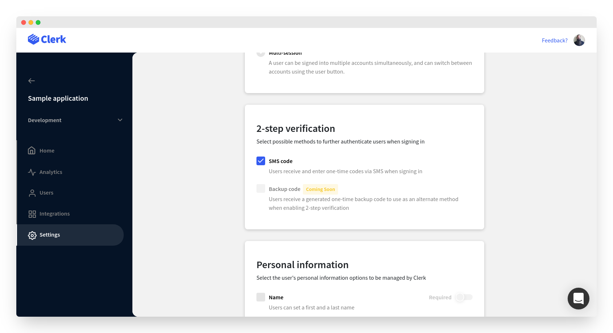
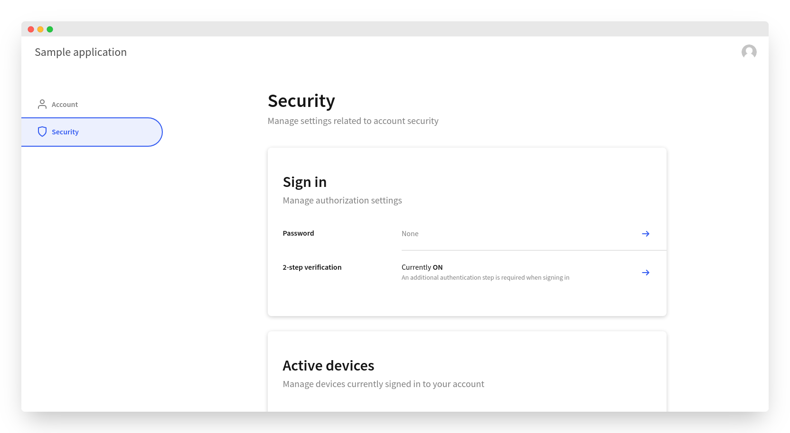

# Multi-factor authentication

## Overview

Clerk supports multi-factor authentication (MFA), often referred as two-factor authentication or 2FA. By enabling MFA, you can encourage or require your users to perform a second verification check during sign in.

The term multi-factor comes from the 3 main types of verifications:

* Knowledge based - something you know, i.e. a password
* Possession based - something you have, i.e. a phone or yubikey
* Inherent based - something you are, i.e. a fingerprint or a facial scan

By enforcing two different types of verifications, you can drastically improve your users security.  Most websites make this step optional, empowering their users with their own security.


Interested in single-factor authentication? Check out our guides on [password-based](email-and-password.md) and [passwordless](passwordless-authentication.md) authentication.


## Before you start

* You need to create a Clerk Application in your [Clerk Dashboard](https://dashboard.clerk.dev). For more information, check out our [Setup your application](setup-your-application.md) guide.
* You need to install [Clerk React](../reference/clerk-react/) or [ClerkJS](../reference/clerkjs/) to your application.

## Configuration

There's two parts to enabling multi-factor authentication for your application. First, you need to apply the appropriate configuration setting in the [Clerk Dashboard](https://dashboard.clerk.dev). Then, registered users need to turn on MFA for their own account through their **User Profile** page.

### Dashboard configuration

From your dashboard, select your application and instance and then go to **Settings** > **User Management** > **2-step verification**. We currently only support a second factor through an **SMS code**. However, we're constantly working on new features.


If you're interested in a specific 2FA method that we don't support yet, [let us know](https://clerk.dev/support)!





Don't forget to click on the **Apply Changes** button at the bottom of the page once you're done.


### User profile configuration

Registered users will still need to enable MFA from their user profile page. Currently, MFA can not be required on all user accounts, this is coming soon.

Users will need to navigate to their user profile, and go to **Security **> **Sign in** > **2-step verification**. From there, they will need to provide a phone number if there's not one on their account, and then enable it for that phone number.



Next, let's see how you can actually add multi-factor authentication to your application. The easiest ways are to use [Clerk Hosted Pages](multi-factor-authentication.md#using-clerk-hosted-pages) or [Clerk Components](multi-factor-authentication.md#using-clerk-components).  If you want more flexibility, you can implement a [custom multi-factor authentication flow](multi-factor-authentication.md#custom-flow) for your application.

## Using Clerk Hosted Pages

If you're looking for the fastest way to implement passwordless based authentication, you can leverage [Clerk Hosted Pages](../main-concepts/clerk-hosted-pages.md) for your sign up, sign in, and user profile pages.  You can set these up on your own domain, and match your websites theme with the Clerk Dashboard to create a seamless experience.&#x20;

You can find your instances sign up and sign in links in the **Home** > **Instance configuration** section of your instance in Clerk Dashboard.&#x20;


By default, the URLs for your hosted pages will match the following pattern:

```http
https://accounts.[your-domain].com/sign-in
https://accounts.[your-domain].com/sign-up
https://accounts.[your-domain].com/user
```


For development instances, Clerk will issue you a domain on "lcl.dev".  In production, you'll need to supply your own domain. See [Production setup](production-setup.md) or more information


Clerk provides SDKs to make navigating to these pages easy. &#x20;



```jsx
import { 
    useClerk,
    RedirectToSignIn,
    RedirectToSignUp
} from "@clerk/clerk-react";

// Rendering the <RedirectToSignIn/> component will
// cause the browser to navigate to the Sign In URL
// and show the hosted Sign In page
function MyRedirectToSignIn() {
    return (
        <RedirectToSignIn/>
    )
}

// Rendering the <RedirectToSignUp/> component will
// cause the browser to navigate to the Sign Up URL
// and show the hosted Sign Up page
function MyRedirectToSignUp() {
    return (
        <RedirectToSignUp/>
    )
}

// You can also trigger a redirect programmatically 
// by calling the redirectToSignUp or redirectToSignIn
// methods 
function MyButtonRedirect() {
    const {redirectToSignUp, redirectToSignIn} = useClerk();

    return (
        <>
            <button onClick={redirectToSignUp}>
                Redirect to hosted Sign Up page
            </button>
            <button onClick={redirectToSignIn}>
                Redirect to hosted Sign In page
            </button>
        </>
    )
}

```



```javascript
// Calling the redirectToSignUp method will
// cause the browser to navigate to the Sign In URL
// and show the hosted Sign Up page
window.Clerk.redirectToSignUp();

// Calling the redirectToSignIn method will
// cause the browser to navigate to the Sign In URL
// and show the hosted Sign In page
window.Clerk.redirectToSignIn();
```




Read our detailed [Clerk Hosted Pages guide](../main-concepts/clerk-hosted-pages.md) to learn more.


## Using Clerk Components

You can leverage [Clerk Components](../main-concepts/clerk-components.md) to easily add multi-factor authentication support to your application.

Clerk provides a [\<SignIn />](../components/sign-in.md) pre-built component that renders a sign in form and takes care of authenticating users and creating a session.

Note that you don't need to pass any special options to the pre-built **\<SignIn />** component. Multi-factor authentication will just work once users enable it under their profile settings, since it's already been configured through the [Clerk Dashboard](https://dashboard.clerk.dev).



```jsx
import { SignIn } from "@clerk/clerk-react";

// SignInPage is your custom sign in page component.
function SignInPage() {
  return (
    // The Clerk SignIn component needs no special
    // configuration. 
    <SignIn />
  );
}
```



```javascript
<html>
<body>
    <div id="sign-in"></div>
    
    <script>
        // Mount the pre-built Clerk SignIn component
        // in an HTMLElement on your page. 
        const el = document.getElementById("sign-in");
        window.Clerk.mountSignIn(el);
        
        // Render the SignIn component as a
        // modal on the page.
        window.Clerk.openSignIn();
    </script>
</body>
```




If you're interested in more pre-built offerings, you can read more about [Clerk Components](../main-concepts/clerk-components.md).


## Custom flow

In case one of the above integration methods doesn't cover your needs, you can make use of lower level commands and create a completely custom multi-factor authentication flow.

You still need to configure your instance in order to enable multi-factor authentication, as described in the [Dashboard configuration](multi-factor-authentication.md#dashboard-configuration) section of this guide. Your users will also need to explicitly enable MFA for their account, as described in the [User profile configuration](multi-factor-authentication.md#user-profile-configuration) section of this guide.

Signing in to an MFA enabled account is identical to the regular sign in process, however, a sign in won't convert until both verifications are completed.&#x20;

The first three steps are part of the standard sign in flow. Steps 4 and 5 power are the additional authentication factor.

1. Initiate the sign-in process, by collecting the user's authentication identifier.
2. Prepare the first factor verification.
3. Attempt to complete the first factor verification.
4. Prepare the second factor verification.  **(This is where MFA comes into play)**
5. Attempt to complete the second factor verification.

Let's see the above in action.&#x20;



```jsx
import { useSignIn } from "@clerk/clerk-react";

function SignInPage() {
    const signIn = useSignIn();
    
    async function onClick(e) {
        e.preventDefault();
        // Sign the user in with email address and 
        // password.
        await signIn.create({
            identifier: "user@example.com",
            password: "********",
        });
        
        // Prepare the second factor verification by 
        // specifying the phone code strategy. An SMS 
        // message with a one-time code will be sent 
        // to the user's verified phone number.
        await signIn.prepareSecondFactor({ 
            strategy: "phone_code", 
        });
        
        // Attempt to complete the second factor 
        // verification, passing the previously 
        // received one-time code.
        await signIn.attemptSecondFactor({ 
            strategy: "phone_code", 
            code: "123456", 
        });
    }
    
    return (
        <button onClick={onClick}>
            Sign in with MFA
        </button>
    );
}
```



```javascript
const { client } = window.Clerk;

// Sign the user in with the required first 
// factor strategy. In this case it's email 
// and password.
const signIn = await client.signIn.create({
    identifier: "user@example.com",
    password: "**********",
});

// Prepare the second factor verification by 
// specifying the phone code strategy. An SMS 
// message with a one-time code will be sent 
// to the user's verified phone number.
await signIn.prepareSecondFactor({
    strategy: "phone_code",
});

// Attempt to complete the second factor 
// verification, passing the previously 
// received one-time code.
await signIn.attemptSecondFactor({
    strategy: "phone_code",
    code: "123456",
});
```




You can learn more details about sign-ins by reading our [Sign in flow](../main-concepts/sign-in-flow.md) documentation.

