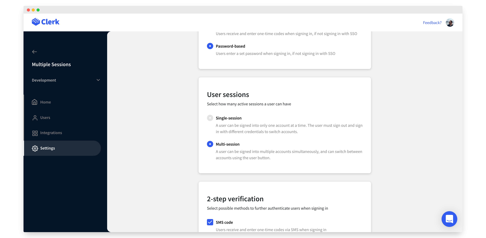

# Multi-session applications

## Overview

One of the most powerful features that Clerk provides out of the box is multi-session applications.

A multi-session application is an application that allows multiple accounts to be signed-in from the same browser at the same time. The user can switch from one account to another seamlessly. Each account is independent from the rest and has access to different resources.  It's most clearly explained by the default **&lt;UserButton /&gt;** below.


Note that you can switch which account is active, add additional accounts, and manage each account independently.  

To enable a multi-session instance, you need to handle the following scenarios:

* Switching between different accounts
* Adding new accounts
* Signing out from one account, while remaining signed in to the rest

There are two main ways to handle all the above: [using Clerk Components](popular-guides-multi-session-applications.md) or [using a custom flow](popular-guides-multi-session-applications.md#custom-flow).


Looking for more information on session management? Check out our [detailed guide](../main-concepts/session-management.md).


## Before you start

* You need to create a Clerk Application in your [Clerk Dashboard](https://dashboard.clerk.dev). For more information, check out our [Setup your application](setup-your-application.md) guide.
* You need to install [Clerk React](../reference/clerk-react/) or [ClerkJS](../reference/clerkjs/) to your application.

## Configuration

The first thing you need to do is to enable the multi-session feature in your Clerk instance.

From the [Clerk Dashboard](https://dashboard.clerk.dev), select your instance, and navigate to **Settings** &gt; **User Management** &gt; **User sessions**. 

Choose **Multi-session**.



That's all you have to do! Now you have a multi-session application!

## Using Clerk Components

The easiest way to add multi-session features to your application is by using the [&lt;UserButton /&gt;](../components/user-button.md) component.

This component has buttons add a new account, switch between accounts and sign out from one or all accounts.



```javascript
import { UserButton } from "@clerk/clerk-react";

const Header = () => {
  return (
    <header>
      <h1>My application</h1>
      <UserButton />
    </header>
  );
};
```



```markup
<html>
<body>
    <header>
        <h1>My application</h1>
        <div id="user-button"></div>
    </header>
    
    <script>
        const el = document.getElementById("user-button");
        // Mount the pre-built Clerk UserButton component
        // in an HTMLElement on your page. 
        window.Clerk.mountUserButton(el);
    </script>
</body>
</html>
```



Note that you don't need to pass any special options to the UserButton component. For more details on all available options, including customization options, please visit the [&lt;UserButton /&gt; guide](../components/user-button.md).

## Custom flow

In case you want more customizability, and you prefer full control over your UI, you can use Clerk's SDKs.

### Active session/user



```javascript
import { useClerk } from "@clerk/clerk-react";

// Getting the active session and user
const { session: activeSession, user: activeUser } = useClerk();
```



```javascript
// Getting the active session
const activeSession = window.Clerk.session;

// Getting the active user
const activeUser = window.Clerk.user;
```



### Switching sessions



```javascript
import { useClerk } from "@clerk/clerk-react";

const { client, setSession } = useClerk();

// You can retrieve all the available sessions through the client
const availableSessions = client.sessions;

// Use setSession to set the active session.
setSession(availableSessions[0].id);
```



```javascript
// You can retrieve all the available sessions through the client
const availableSessions = window.Clerk.client.sessions;

// Use setSession to set the active session.
window.Clerk.setSession(availableSessions[0].id);
```



### Adding sessions

To add a new session, simply link to your existing sign in flow. New sign ins will automatically add to the list of available sessions on the client.

To create a sign in flow, please check one of the following popular guides: 

* [Email and password](email-and-password.md)
* [Passwordless authentication](passwordless-authentication.md)
* [Social login \(OAuth\)](social-login-oauth.md) 

For more information on how Clerk's sign in flow works, checkout our detailed [sign in guide](../main-concepts/sign-in-flow.md).

### Sign out active session

This version of sign out will deactivate the active session. The rest of the available sessions will remain intact.



```javascript
import { useClerk } from "@clerk/clerk-react";

const { signOutOne } = useClerk();

// Use signOutOne to sign-out only from the active session.
await signOutOne();
```



```javascript
// Use signOutOne to sign-out only from the active session.
await window.Clerk.signOutOne();
```



### Sign out of all sessions

This request will deactivate all sessions on the current client.



```javascript
import { useClerk } from "@clerk/clerk-react";

const { signOut } = useClerk();

// Use signOut to sign-out all active sessions.
await signOut();
```



```javascript
// Use signOut to sign-out all active sessions.
await window.Clerk.signOut();
```



