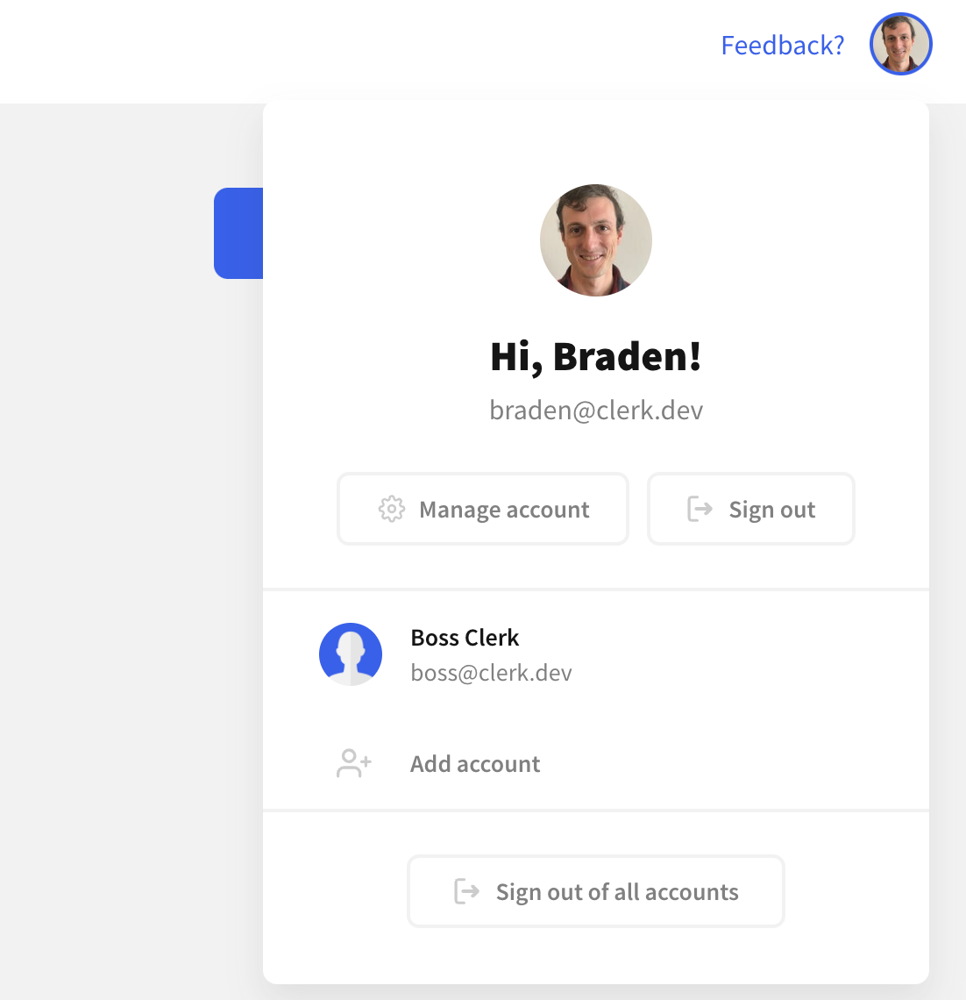

# Sign out

## Overview

Once you have a signed in user, you need to give them a way to sign out.

Please note that the sign out flow only deactivates the current session. Other valid sessions that correspond to the same user \(e.g. if the user is signed in on another computer\) will continue to work.

You can either sign out users in Clerk via the [Clerk Components](popular-guides-sign-out.md#using-clerk-components) or build a completely [custom flow](popular-guides-sign-out.md#custom-sign-out) using ClerkJS or Clerk React.

## Before you start

* You need to create a Clerk Application in your [Clerk Dashboard](https://dashboard.clerk.dev). For more information, check out our [Setup your application](setup-your-application.md) guide.
* You need to install [Clerk React](../reference/clerk-react/) or [ClerkJS](../reference/clerkjs/) to your application.

## Using Clerk Components

The simplest way to sign out users is via the [&lt;UserButton /&gt;](../components/user-button.md) component. The user button is a pre-built UI component that gives a signed in user a way to manage their account. One of the options is a **Sign out** button.




Make sure you've followed the installation guide for [Clerk React](../reference/clerk-react/installation.md) or [ClerkJS](../reference/clerkjs/installation.md) before running the below snippets.




```jsx
import { UserButton } from "@clerk/clerk-react";

const Header = () => {
  return (
    <header>
      <h1>My application</h1>
      <UserButton />
    </header>
  );
};
```



```markup
<html>
<body>
    <header>
        <h1>My application</h1>
        <div id="user-button"></div>
    </header>
    
    <script>
        const el = document.getElementById("user-button");
        // Mount the pre-built Clerk UserButton component
        // in an HTMLElement on your page. 
        window.Clerk.mountUserButton(el);
    </script>
</body>
</html>
```



Note that you don't need to pass any special options to the &lt;UserButton /&gt; component. For more details on the available component options as well as how you can customize them, please visit the [UserButton component guide](../components/user-button.md).

## Custom sign-out

In case the pre-built user button doesn't cover your needs and you prefer a custom sign out flow, you can easily make use of our SDKs.


Make sure you've followed the installation guide for [Clerk React](../reference/clerk-react/installation.md) or [ClerkJS](../reference/clerkjs/installation.md) before running the below snippets.




```jsx
import { useClerk } from "@clerk/clerk-react";

const SignOutButton = () => {
  const { signOut } = useClerk();
  return (
    <button onClick={() => signOut()} >
      Sign out
    </button>
  );
};
```



```javascript
// Signs-out the current user.
await window.Clerk.signOut();
```




For more information on session management, please check our detailed [Session management](../main-concepts/session-management.md) guide.


