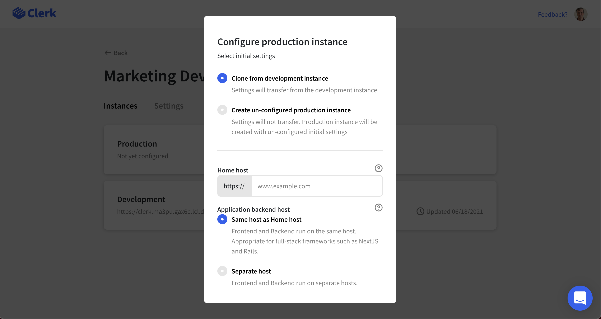
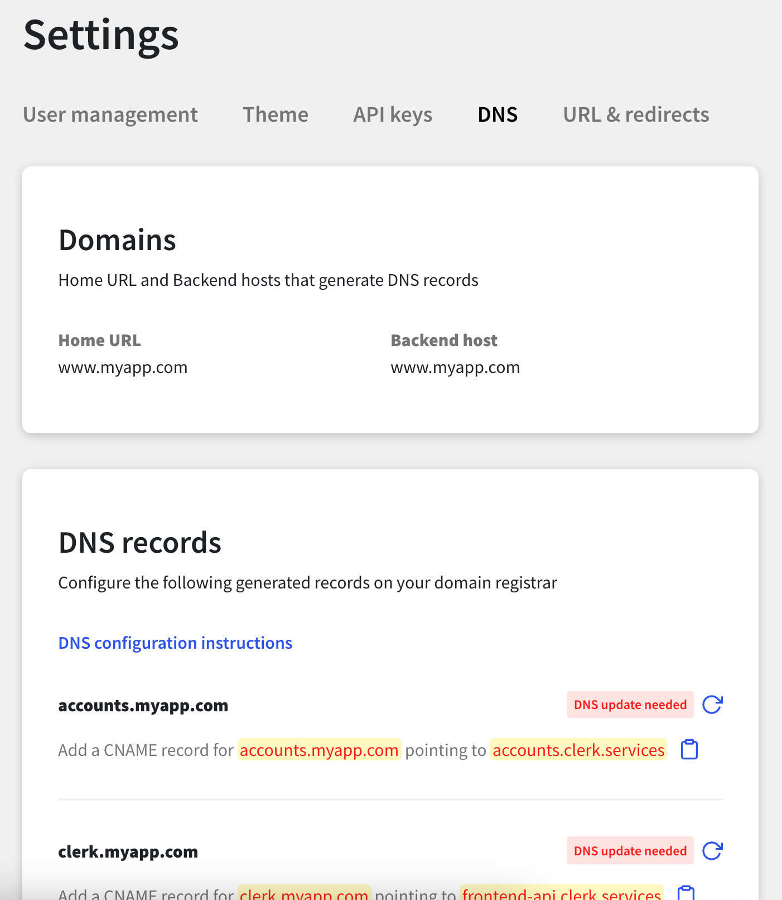

# Deploy to production

## Overview

Before you share your app to the world, you'll need to create a production instance.  While development instances are convenient, they are not as secure as Clerk's production environment.


It is strongly recommended that you **do not** go live with a development instance,  we are soon going to put up warning messages around this.



Deploying on a Clerk provided domain is coming soon.


## Before you start

* You should already have your app working with a development instance.
* You will need to be able to add DNS records on your domain.
* You will need Social Login \(OAuth\) credentials for any providers that you would like to use in production.

## Creating your production instance

The modal is relatively straight forward, but there's a few things you should know.  Your development and production instances are separate entities, and don't share anything -- to match your development instance you should clone it's settings, which we make easy.  If you ever need to change a setting, you should do it in development first to make sure everything works, before making the change to your production instance.  


URL and redirects settings may not copy over, you will need to set these values again.



Integrations you have setup will not copy over.  You will need to re-enable these.


There are several different app architectures, and Clerk needs to know which type you run, in particular, Clerk needs to know where to put your session cookies so that your backend can see them.  If you're not following standard development practices for these frameworks, your situation might be an exception.

**Full-stack web frameworks  - e.g. Ruby on Rails, Django, Next.js**

* Enter your applications domain, then for **Application backend host** choose "**Same host as Home host**"

With these frameworks, your API is usually on the same host as your frontend. A host consists of both your root domain, and any subdomains, and does not include any path.  So, `www.example.com` would be the host that serves your API requests.  Next.js works this way as well, your API routes would be located at  `www.example.com/api`

**Client-side frameworks - e.g. React + Node.js, React + API**

* Enter your applications domain, then for **Application backend host** choose "**Seperate host"**, and enter the host for your backend.

With these frameworks, your API is usually on a different host than your frontend. A host consists of both your root domain, and any subdomains, and does not include any path.  So, while `www.example.com` can serve your frontend, your API might live on `api.example.com`.  By choosing this, Clerk will put your session cookies where your API can see them.

## API Keys and Environment variables

A common mistake when deploying to production is forgetting to change your API keys to your production instances keys.  The best way to set this up, is to make use of **Environment variables.**  All modern hosting providers, such as AWS, GCP, Vercel, Heroku, Render, etc.. make it easy to add these values.  Locally, you should use an `env` file, this way these values are being set dynamically depending on your environment.  Here's a list of Clerk variables you'll need to change:

* Frontend API
  *  Formatted `clerk.123.abc.lcl.dev` in development, and `clerk.example.com` in production.  and is passed to the **&lt;ClerkProvider /&gt;** during initialization
* API Key
  * Formatted `test_xxxxx` in development,  and `live_xxxxx` in production.  These values are used to access Clerk's Backend API
* OAuth credentials
  * In development, Clerk provides you with a set of shared OAuth credentials.  These are not secure in production, and you will need to provide your own.

## DNS Records

Clerk uses DNS records to provide session management, and emails verified from your domain.  You will need to go to **Settings &gt; DNS** to see the records that you need to set.  Note: It can take up to 24hrs for DNS Records to fully propagate, so be patient.  


Some DNS providers will automatically append the domain for the 'To' field, if this is the case, you will need to omit your domain from the 'To' field.  So, add 'clerk' instead of 'clerk.example.com'.



**Do not proxy your  records**

Clerk uses a DNS check to validate this CNAME record.

If this subdomain is reverse proxied behind a service that points to generic hostnames, such as Cloudflare, the DNS check will fail. Please set the DNS record for this subdomain to a "DNS only" mode on your host to prevent proxying.


## Deploy

That's all! Once you've completed all the above steps, you're ready to go to the home page, and press **Deploy**!  If you run into any trouble feel free to reach out to any of our [support channels](https://clerk.dev/support) and we can help you out.

