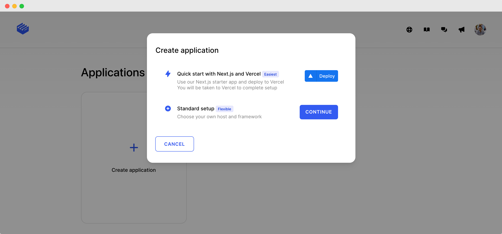
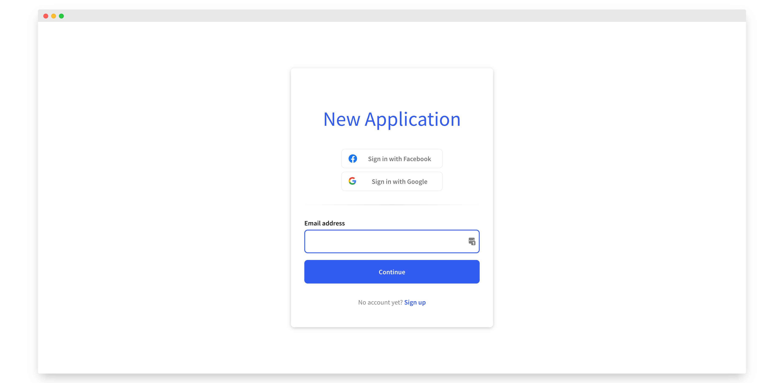

# Set up your application

## Create an application

The first thing you need to do is head over to the [Clerk Dashboard](https://dashboard.clerk.dev) and click on the **Create Application** button. At the moment, there are two ways to create an application:

* Get up and running in a matter of minutes via our [Vercel](https://vercel.com) integration. Use our Next.js starter app and deploy your application to Vercel.
* Follow our standard setup to have complete flexibility on where you host your application and which framework you use.

An application is comprised of different instances. In particular, once the application is created, you should be able to see the following instances:

* **Development**: This is the instance you can use to develop your application. Please note that, for security reasons, you must not use your development instance in production.
* **Staging** (_only for Vercel setup_): _coming soon..._
* **Production**: This is the instance that will be used by your application and will accept live traffic. For more information on how to set up production instances, please follow our [Deploy to production](production-setup.md) guide.


The application instances are completely independent of each other. If you make changes in your development instance, these changes do **not** automatically propagate to the rest of the application instances.



For security reasons, **only production instances** **should be used for live traffic**. Development and staging instances should only be used for development purposes.


Now that we have an application, let's continue by configuring our development instance. In the rest of this guide we'll talk about:

* [how to set up user authentication and management](setup-your-application.md#user-management)
* [how to configure your application theme](setup-your-application.md#theme)
* [how to set up your application URLs](setup-your-application.md#url-and-redirects)

## Authentication

These configuration settings affect how the users of your application can sign in and sign up as well as which attributes are editable via their user profile. You can find these settings under **Authentication** section.

### Standard Form Fields

The selected contact method on this section will affect what fields will be required during [sign up](../main-concepts/sign-up-flow.md). The selected account identifiers will also be used to allow users to sign in.

At the moment there are four available options:

* **Email address**: During sign up, a user must supply and verify their email address, and they must always have at least one email address on their account at all times. Also, the user can sign in using their email address.
* **Phone number**: During sign up, a user must supply and verify their phone number, and they must always have at least one phone number on their account at all times. Also, the user can sign in using their phone number.
* **Email address OR phone number**: During sign up, a user must supply and verify either a phone number OR an email address, and they must always have at least one phone number OR email address on their account at all times. Similarly, during sign in, users can use either their phone number or email address.
* **None**: You can disable Standard Form Fields for sign up. In order to select this option, you need to require a [social provider](setup-your-application.md#sso).

### Social Login

Clerk offers a list of Social Login providers that can be used during sign up and sign in. For each of the selected providers, there will be a button on sign in and sign up pages with the provider's logo and the appropriate text.

The Social Login process is smart enough to automatically convert a sign up flow of an already registered user into a sign in flow and vice versa. For more information on how to set up sign up and sign in flows using social providers, check our [detailed guide](social-login-oauth.md).

For each provider, Clerk is offering a shared profile that can be used for development. However, for security reasons, production instances **must** use a custom profile with its own credentials.

At the moment, we support the following social providers:

* [Google](../reference/social-login-reference/social-login-google.md)
* [Facebook](../reference/social-login-reference/social-login-facebook.md)
* [Twitter](../reference/social-login-reference/twitter.md)
* [TikTok](../reference/social-login-reference/tiktok.md)
* [Discord](../reference/social-login-reference/discord.md)
* [Twitch](../reference/social-login-reference/twitch.md)
* [Github](../reference/social-login-reference/github.md)
* [Gitlab](../reference/social-login-reference/gitlab.md)
* [Hubspot](../reference/social-login-reference/hubspot.md)


Don't see the provider you need? [Request others here](https://www.clerk.dev/support)_,_ we can usually add them within a week's time.


### Usernames

This setting controls whether the users can define and use custom usernames to sign up and sign in.


Users signing up via an SSO provider, won't have a username. In this case, they will need to manually enter a username via their user profile.


### Authentication strategy

This setting controls whether users can sign in using a registered password or their authentication process will rely solely on passwordless means like email magic links and one-time codes.

* **Password**: Selecting this option will force users to provide a password during their sign up process. Clerk offer out of the box protection against [weak and leaked passwords](../learning-center/security/password-protection.md). Note that the passwordless option is still available to the users even if password-based is selected. For more information on how to setup password-based authentication, check our [detailed guide](email-and-password.md).
* **Passwordless**: Send an Email Magic Link or an Email or SMS passcode (OTP) to the user, so that they can verify they own their account. For more information on how to set up passwordless authentication, check our [detailed guide](passwordless-authentication.md).


Users signing up via an SSO provider, won't have a password even if password-based authentication strategy is selected. In this case, they will need to manually enter a password via their user profile.


### Sessions

This setting affects how many accounts users can have in a single browser tab.

Clerk offers multi-sessions out of the box, just by selecting the respective option in this section. If **Multi-session handling** is selected, then users can sign into multiple accounts and easily switch between them.

For more information on how to work with multi-session applications, check our [detailed guide](popular-guides-multi-session-applications.md).

Clerk also offers the ability to control your application's security by tweaking your session duration. For more information check our [Session Lifetime guide.](../main-concepts/session-lifetime.md)

### Multi-factor

For additional security, you can give the option to your application users to enable multi-factor authentication. In this section you can select which multi-factor methods can be used. At the moment we support the following:

* **SMS code**: A one-time code that is sent to your user's phone number.

For more information on multi-factor authentication, check our [detailed guide](multi-factor-authentication.md).


In addition to enabling 2-factor authentication in your instance, each user will also need to enable it via their user profile in order to use it.


### User model

In this section you can define what personal information must be collected from a user.

Whatever you select here will affect the resulted [sign up flow](../main-concepts/sign-up-flow.md) since the user will need to supply this additional information. Every field you select here will be editable through the [user's profile](../components/user-profile/user-profile.md).

For each of the selected personal information you can choose whether it's required or optional. If something is required, then the user must supply it during the sign up flow, and cannot be emptied afterwards.

At the moment, we support the following personal information:

* **Name**: This is the name of the user and it's actually split into two fields, first and last name.

## Theme

The settings on this section control the look and feel of your application. From here you can control the colors, fonts, spacing and other properties of your application.

These settings affect all [Clerk Components](broken-reference) of your application.

The theme settings we provide are:

* **Primary color**: This is the default accent of your application. This setting will affect primary and secondary buttons, active borders, links, back buttons, etc.
* **Background color**: This setting controls the background color of Clerk Components.
* **Font and font color**: Controls the font and the color of all text in Clerk Components, except from the button text.
* **Label font weight**: Controls the font weight of labels in Clerk Components.
* **Rounded corners**: Controls whether the Clerk Components will have rounded corners or not. Please note that the border radius of the rounded corners is predefined (_0.5 em_).
* **Shadow**: Controls whether the Clerk Components will have shadow or not. Please note that the shadow size is predefined (_0 2px 8px rgba(0, 0, 0, 0.2)_).
* **Spacing**: Controls whether the spacing between the elements of Clerk Components will be the standard spacing (_1 em_) or compact spacing (_0.75 em_)
* **Button font, font color and font weight**: These settings control how the button text of the Clerk Components will look like.
* **Page background color**: Controls the background color of the [Clerk Hosted Pages](broken-reference).

### Code-side theming

For more control and flexibility over the theming of your Clerk Components, you can specify theming options at the code level following our [customization guide](../components/customization.md#overview) using the `theme` prop and Clerk CSS variables.

## Paths

_Coming soon..._
