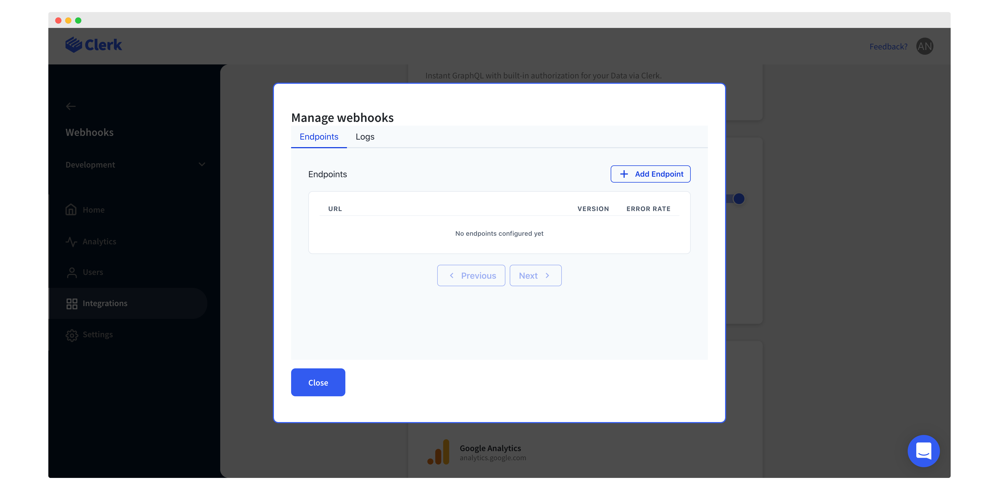
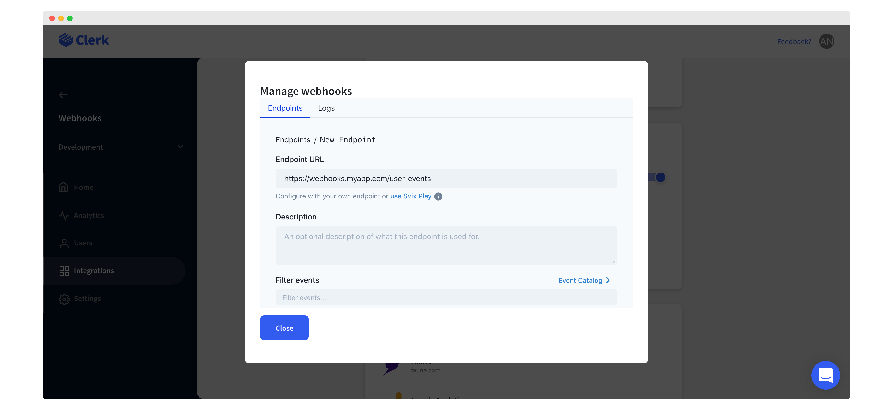

# Sync data to your back-end

## Overview


For most of the use cases, data syncing is not needed at all and this guide can be skipped.

ClerkJS provides all the information you might need when using Clerk, including the user id, session id and any other user data needed for presentation on a website.


A common setup for applications involves a front-end and some sort of back-end storage system. Since authentication and user management happens on Clerk's side, data eventually need to reach the application's back-end.

The recommended way to sync data between Clerk and your application's back-end is via webhooks. In this guide you'll learn how to enable webhooks and how to setup your back-end so that it is updated every time an event happens on your Clerk instance.

Given the asynchronous nature of webhooks, they might not fit in every use case out there. If your application requires synchronous updates, refer to our [Synchronous data updates](sync-data-to-your-back-end.md#undefined) section.

## Before you start

* You need to create a Clerk Application in your [Clerk Dashboard](https://dashboard.clerk.dev). For more information, check out our [Setup your application](setup-your-application.md) guide.

## Webhooks configuration

Clerk provides webhook support by integrating with [Svix](https://www.svix.com).&#x20;

The Svix integration can be enabled through [Clerk Dashboard](https://dashboard.clerk.dev), by going to your instance and then to **Integrations** > **Svix**. Use the toggle button to enable/disable the integration.

Once the Svix integration is enabled, you will need to configure the endpoints of your application which will receive the various Clerk events. You can do that by clicking on **Manage webhooks **> **Add endpoint**.

You can then enter the actual endpoint URL and choose the Clerk events you want to receive to this endpoint. This endpoint URL should be the endpoint exposed by your back-end which will process the Clerk events.&#x20;

Once you're ready, click on **Create** to finalize the endpoint setup.


Selecting no events means that the endpoint will be listening for **all** Clerk events.


You can add as many endpoints as it makes sense for your use case and associate each endpoint with as many events you want. For example, you could have a single a single endpoint for all Clerk events you're interested in, or have dedicated endpoints for each group of events or even for each event individually.

Keep in mind though, that a Clerk event will be sent to all the endpoints it is associated with. So, if you have multiple endpoints associated to the same events, your endpoints will receive duplicate event messages.

## Sync data to your back-end via webhooks

For every action the users perform in Clerk via the application's front-end, Clerk will generate a Clerk event which will be sent to the appropriate webhooks that you've already setup. Your back-end webhook endpoints will eventually receive the Clerk events and can do the necessary processing.

A very common pattern is to keep a local copy of your Clerk user information for performance and data consistency purposes. This local copy should **only** be updated by the Clerk events that arrive to the webhook endpoints.

An example of the above process can be found in our [Widget example application](https://github.com/clerkinc/clerk-nextjs-examples/tree/main/examples/widget).

## Clerk event messages

At the moment, Clerk will generate events when there is an action that modifies either a user or a session resource. For an extensive list of the Clerk events that can be generated, the payload and how you can verify incoming webhook messages, check our [webhooks reference](../reference/webhooks.md).

## Synchronous data updates

Although webhooks is the preferred way for your back-end application to stay up to date with user and session changes, their asynchronous nature might not be ideal for some applications out there. Because of the way they work, your application needs to be designed in a way that handles the [eventual consistency](https://en.wikipedia.org/wiki/Eventual\_consistency) that comes with asynchronous communication.

If your application requires strong consistency, you can utilize the endpoints of our [Backend API](../reference/backend-api-reference/) to get the latest state of users and sessions.

In this case, the application's front-end needs to notify the back-end for changes regarding users and sessions. Once the back-end is notified, it needs to communicate with Clerk synchronously using the Backend API endpoints to receive the latest state and update the local state accordingly.


Although this pattern provides the ease of synchronous communication, it lacks when it comes to availability and data integrity. There are too many things that could go wrong which would result in the back-end storage being out-of-sync with Clerk.

