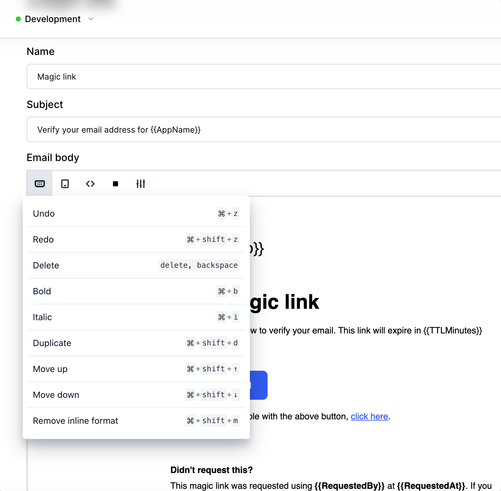
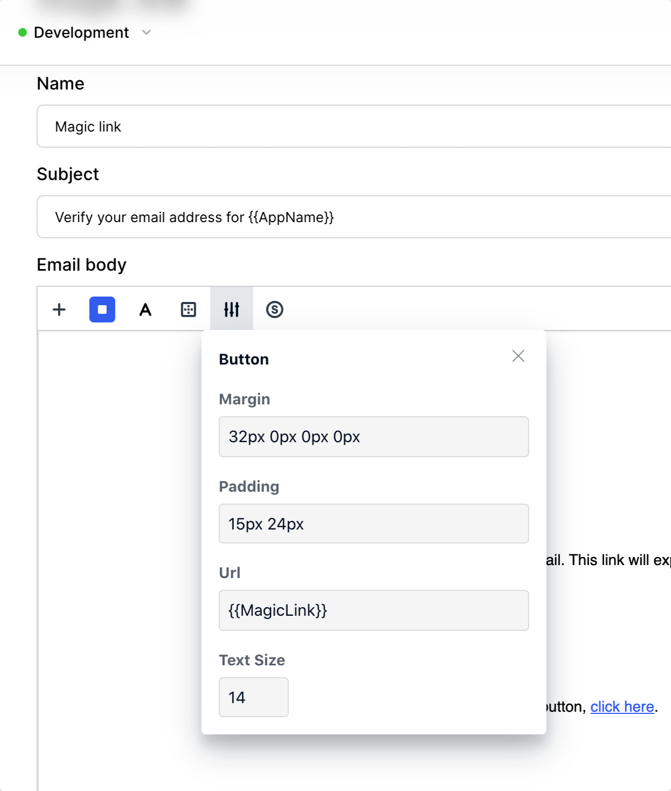
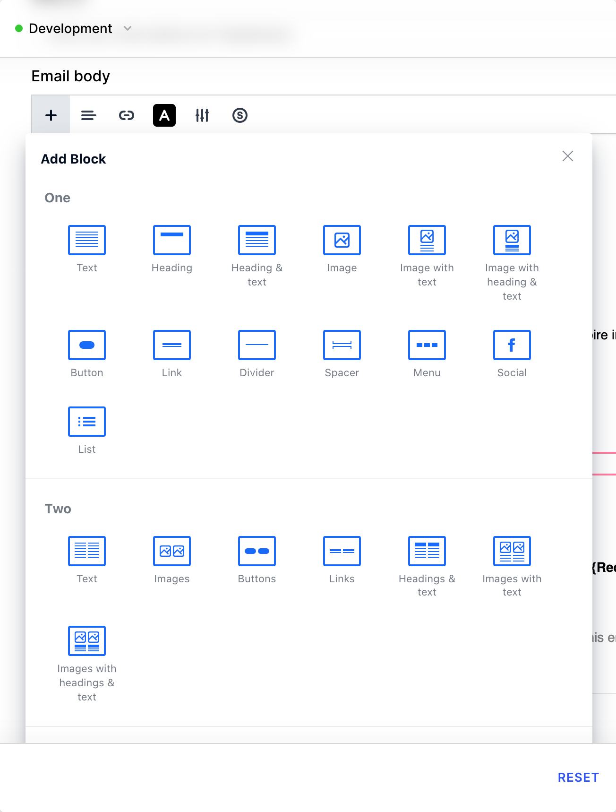
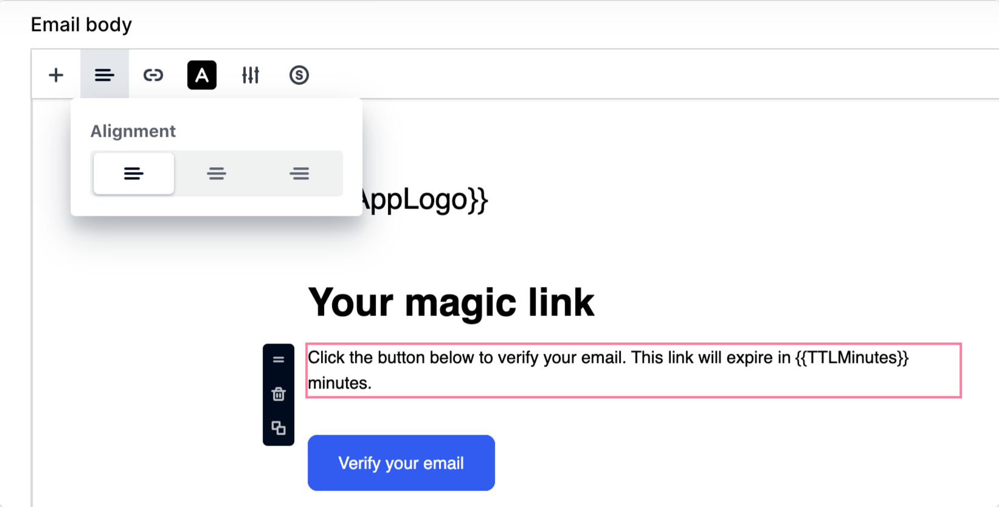
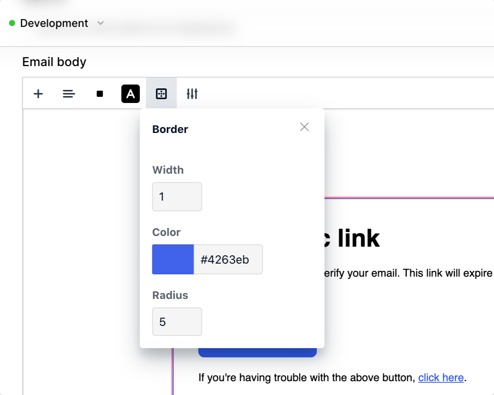
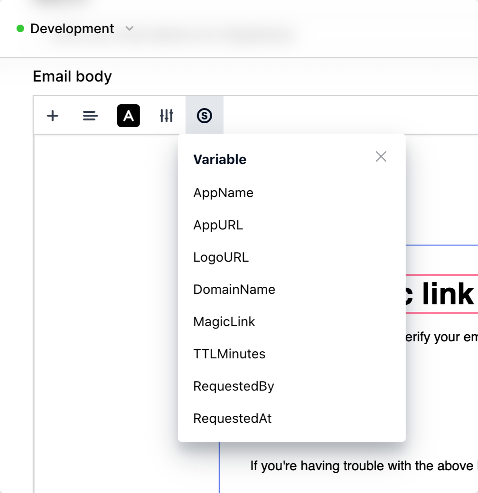
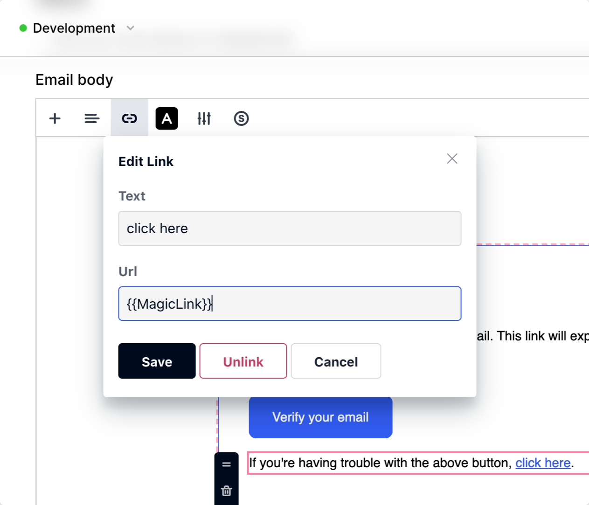
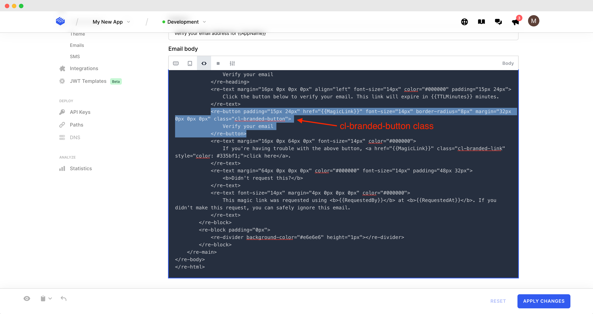
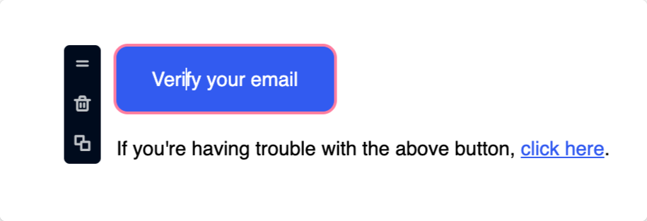

# Email & SMS templates

## Overview

Clerk offers the capability to override the default system email & SMS messages that are sent out during authentication flows, via its templating system.

The template editor enables you to change the wording and styling so that it is more consistent with your own branding.

It is also a useful way to translate the content to another target language in the case that English is not the default locale of your application.

### Terminology

It will be useful to take a look at the following terms as they will reappear in the rest of the guide:

| Term          |                                                                                                                                                                                                                                                                           |
| ------------- | ------------------------------------------------------------------------------------------------------------------------------------------------------------------------------------------------------------------------------------------------------------------------- |
| template slug | machine-friendly name of the template, this will be visible in the dashboard edit link URL                                                                                                                                                                                |
| template name | user-friendly name of the template, this will be visible on the template listing page                                                                                                                                                                                     |
| variables     | also known as merge tags in the context of email marketing, these are placeholders that are replaced with dynamic data when the actual email or SMS is being sent to the recipient                                                                                        |
| WYSIWYG       | What You See Is What You Get, a term used for editors and design tools that allow you create content or layout in visual manner (i.e. without requiring you to edit the underlying markup) so that you can instantly see how the result is going to display to your users |
| blocks        | email WYSIWYG editors enable you to use blocks, rows and columns in order to control the layout of their content (this is then transpiled to table-based HTML)                                                                                                            |

## Available templates

In this section you can see which templates can be modified at the time of writing.

### Email

The following email templates are available for editing:

* Invitation (slug: `invitation`) - email sent to a person invited to join your application
* Magic link (slug: `magic_link`) - email containing magic link to allow the user to sign in without providing a password, or verify the ownership of an email address
* Verification code (slug: `verification_code`) - email containing an OTP (One Time Password) code for verifying account access

### SMS

The following SMS templates are available for editing:

* Invitation (slug: `invitation`) - SMS sent to person invited to join your application
* Verification code (slug: `verification_code`) - SMS containing an OTP code for verifying account access

## Before you start

### Revolvapp WYSIWYG email editor plugin

The email editor uses the [Revolvapp](https://imperavi.com/revolvapp) email template editor plugin by Imperavi. To acquaint yourself with the template markup syntax, please consult the corresponding [documentation page](https://imperavi.com/revolvapp/docs/syntax/quick-start).

As you will see, the template markup is an HTML-like language and each type of node supports its own set of attributes which control its behavior. A lot of the attributes are borrowed from HTML itself.

Revolvapp allows the user to design the template using blocks and under the hood transpiles its markup to table-based HTML so that the resulting email renders consistently across email clients.

### Handlebars templating language

Both the email and SMS editor use the [Handlebars](https://handlebarsjs.com) templating language for the interpolation of dynamic values into your content via variables. It is a well established language, especially popular in the Javascript ecosystem, which has been adopted by leading Email Service Providers (ESPs) for templating as well.

The most core Handlebars concept you should bear in mind is that in order to output a variable you should wrap its name within double curly braces, for instance `{{AppName}}`. When the message is to be sent this will be replaced with the actual name of the application.

Using the variable insertion widgets, the variables will be inserted into the content at the desired position so there no need to write them by hand, though you can of course still do so if you like.

For further information on Handlebars we recommend you take a look at the [official guides](https://handlebarsjs.com/guide/).

There will definitely be a learning curve before you master both Revolvapp syntax and Handblebars, but we have no doubt that you will be crafting beautiful templates in no time!

## Template operations

Please consult the following sub-sections to see which operations are available in the template editor. Note that depending on the state of the template and the current application subscription plan, one or more operations may not not available.

### Edit

Editing templates allows you to customize existing Clerk-sent emails and SMS messages to make them more inline with your own branding.

To edit a template, click on the desired template card from the template listing page that can be found at the following locations:

* For emails: **Customization > Emails**
* For SMS: **Customization > SMS**

To persist your changes, click on the **Apply Changes** button at the bottom right.

Your changes will then take immediate effect for the corresponding application instance.

Templates are editable:

* On the **development** instance of applications on any subscription plan (free or paid)
* On the **staging** and **production** instances of paid plans

This allows you freely test the templating feature on your development environment so as to see if it fits your individual use case, before deciding on a plan upgrade.

.png>)

### Preview

The Preview operation enables you to get an idea of how the template will render when sent to the the recipient. This is useful for sampling your changes without actually having to commit them first.

To trigger a preview, you can click on the **Preview Icon** at the bottom left of the screen (see screenshot below).

In email templates, the `AppLogo` and `Copyright` sections will be replaced with their actual markup in this view. For both emails & SMS, the template variables will be replaced with sample values.

Previewing is available for all templates.

### Reset

While editing a template, you can undo all changes since the last save by clicking on the **Reset** button at the bottom right of the Edit page.

Note that the button will be disabled if there are no changes since the last save.

Template reset is applicable to editable templates.

### Revert

Even if you override a Clerk-provided template with your own customizations, you can always roll back to the system default template version by clicking on the **Revert Icon** (see screenshot below).

This can be useful if you want to start over from scratch.

Note: your current changes will be lost so please make sure you indeed wish to discard them prior to reverting. You will be asked to confirm your choice to prevent an unintentional action.

### Copy to another instance of the same application

If your application has more than one instance, then you will also have the option of copying the current state of the editor to another instance.

This is especially useful for promoting changes from your **development** or **staging** environment to **production**, after you have tested them.

To copy to another instance you will need to first click on the **Copy to** icon (see screenshot below) and then from the sub-menu select the target instance.

Since this change will override the current state of the template on the target instance, you will be  asked to confirm your choice.

Note that the copy icon will not appear if there are no other instances available on your application.

.png>)

## Email template editor&#x20;

The email WYSIWYG editor is split into two parts:

1. The toolbar
2. The text area

Since the toolbar exposes quite a few tools, we will examine them in more detail in the following sub-sections.

### Toolbar controls

Note that the toolbar contains 2 types of controls:

1. Buttons - expose a sub-menu with more settings you can apply to the currently selected block or text; you can switch from one button to another with a single click
2. Toggles - switch the editor to another view mode, in which all other tools become disabled; to exit the current mode you will need to toggle back

#### Shortcuts button

Opens a popup with the keyboard shortcuts that the editor supports. Note that the editor supports the usual Copy, Paste, Undo and Redo shortcuts you might be accustomed to from other editors.

#### Mobile view toggle

Shows how the email will render on a mobile device with a portrait aspect ratio.

Click on the mobile view toggle again to return to desktop view.

.png>)

#### HTML mode toggle

Switches the editor to source mode. The source format is Revolvapp's own template syntax, which is HTML-like and transpiles to HTML that can be rendered by browsers and email clients.

For this tool to appear you will need to unselect any currently selected block.

To exit HTML / source mode, click on the toggle again.

#### Background button

Allows selecting a color or image as a background for the currently selected block.

#### Settings button

Opens a popup with settings contextually based on the selected block or text.

#### Add block button

This button allows you to insert a new block of content.

For the button to appear you will need to select the existing block below which you would like the new block to be inserted.

The editor comes with a number of predefined blocks such as blocks with a header, image, button, multiple columns, etc.

#### Alignment button

Enables horizontal alignment (left, right or center).

#### Text color

Exposes a color picker so that you can select the color of the fonts in the affected block or text fragment.

#### Border

Permits setting a border width, color and radius on a given block. Using the radius you can give a block rounded corners.

#### Variable button

Shows a dropdown with the available variables for the current template.

For the variable button to appear, you will need to click inside a text node.

Upon insertion the variable will be automatically wrapped in curly braces, there is no need to add them yourself.

#### Link

Converts a selected text fragment into a link. Users can configure the link text and the URL that the link should point to.

#### Image

Enables you to insert an image into the document.

Note: currently only providing a link to image is supported.

It is possible to configure the image width and Alt Tex, as well as turn it into a link.

 (1).png>)

### How to make buttons & links inherit your theme colors

As you may have noticed, the links and buttons in the Clerk-provided templates automatically show in the colors selected in the **Customization > Theme** section.

Specifically:

* The color of buttons and links in your emails maps to the primary color set in your theme
* The font color of buttons in your emails maps to the button text color set in your theme

Since you may not want all buttons or links to have this behavior, you will need to opt in by using the following classes:

* `cl-branded-button` - for buttons
* `cl-branded-link` - for links

These classes can be added as attributes to the Revolvapp template markup after toggling the editor to HTML (i.e. source) mode.

### Text area controls

The email editor text area is intended mainly for authoring content, though if you click on a block a set of tools will also appear, namely:

* Move handle - Allows the selected block to be moved up or down with regard to its sibling blocks
* Delete - Removes the block from the template
* Clone - Clones the block using the exact same settings

## SMS template editor

The SMS editor is much simpler to use since SMS supports plain text only.

You can edit the message contents to your liking via the provided text area.

When you are satisfied with your edits you can persist them by clicking on the **Apply Changes** button.

### Variable widget

To insert a variable at the current cursor position, you can click on the corresponding variable badge in the variable widget that is located adjacent to the text area.

