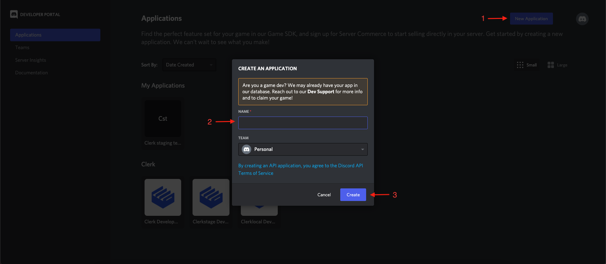
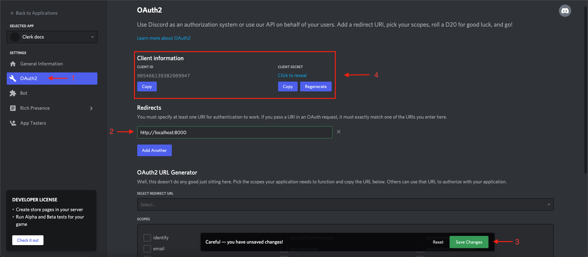

# Discord

## Overview

Adding social login with Discord to your app with Clerk is simple - you only need to set the **Client ID**, **Client Secret** and **Authorized redirect URI** in your instance settings.

To make the development flow as smooth as possible, Clerk uses preconfigured shared OAuth credentials and redirect URIs for development instances - no other configuration is needed.

For production instances, you will need to generate your own Client ID and Client secret using your Discord account.


The purpose of this guide is to help you create a Discord account and a Discord OAuth app - if you're looking for step-by-step instructions using Clerk to add social login (OAuth) to your application, follow the [Social login (OAuth)](broken-reference) guide.


## Before you start

* You need to create a Clerk Application in your [Clerk Dashboard](https://dashboard.clerk.dev). For more information, check out our [Setup your application](broken-reference) guide.
* You need to have a Discord account. To create one, [click here](https://discord.com/register).

## Configuring Discord social login

First, you need to register a new OAuth Discord app at the [Discord Developer Portal](https://discord.com/developers/applications).

Set a name for your new application and click create. Now that your application has been created, from the left side panel click on **OAuth2**, this is where you also need to add your **Redirect URL.** Go to the [Social Login page](https://dashboard.clerk.dev/last-active?path=authentication/social) and enable Discord. In the modal that opened, ensure **Use custom credentials** is enabled and copy **Authorized redirect URI**. Paste the value into the **Redirect** input and save the changes.

Once all the above are complete, copy the **Client ID** and **Client Secret.** Go back to the Clerk Dashboard and paste them into the respective fields.

Don't forget to click **Apply** in the Clerk dashboard. Social login with Discord is now configured 🔥

## Next Steps

Learn how to add social login with GitLab to your Clerk application by following the [Social login (OAuth)](broken-reference) guide.
