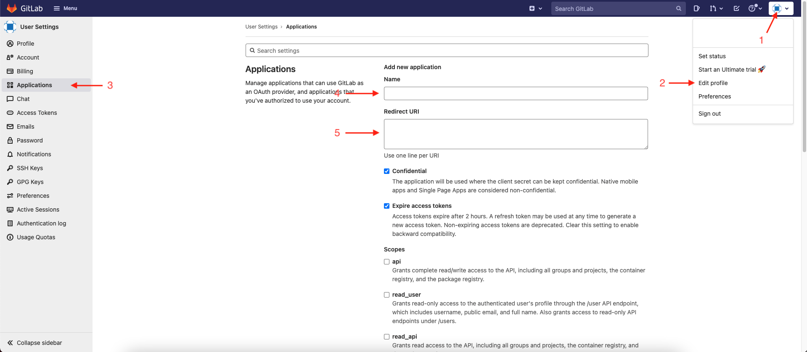
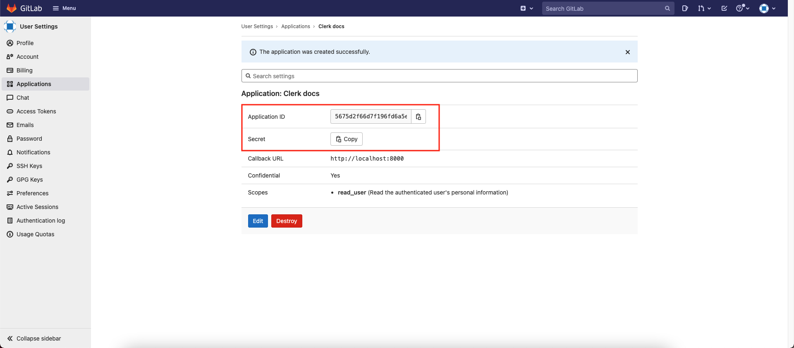

# GitLab

## Overview

Adding social login with GitLab to your app with Clerk is simple -  you only need to set the **Client ID**, **Client Secret** and **Authorized redirect URI** in your instance settings.

To make the development flow as smooth as possible, Clerk uses preconfigured shared OAuth credentials and redirect URIs for development instances - no other configuration is needed.&#x20;

For production instances, you will need to generate your own Client ID and Client secret using your Github account.


The purpose of this guide is to help you create a Github account and a Github OAuth app - if you're looking for step-by-step instructions using Clerk to add social login (OAuth) to your application, follow the [Social login (OAuth)](../../popular-guides/social-login-oauth.md) guide.


## Before you start

* You need to create a Clerk Application in your [Clerk Dashboard](https://dashboard.clerk.dev). For more information, check out our [Setup your application](../../popular-guides/setup-your-application.md) guide.
* You need to have a GitLab account. To create one, [click here](https://gitlab.com/users/sign\_up).

## Configuring GitLab social login

First, you need to register a new OAuth GitLab app. Follow the official GitLab instructions on [how to create an OAuth app](https://docs.gitlab.com/ee/integration/oauth\_provider.html#user-owned-applications).

You need to add a name for your new application and the **Redirect URI**. Go to the [Clerk Dashboard](https://dashboard.clerk.dev), select your **Application**,** **and navigate to **Instances ** ➜  **Settings** ** **➜  **User Management **➜ **SSO**.  Click the **Manage credentials **button under the Github provider, select **Custom profile** and copy the **Authorized redirect URI**. Go back to the GitLab panel, paste the value into the **Redirect URI**, select any scopes that would you like your users to provide and save the application.

Once creation is complete, you'll get redirected to application's panel. Copy the **Application ID** and **Secret.** Go back to the Clerk Dashboard and paste them into the respective fields.

Don't forget to click **Apply **in the Clerk dashboard. Social login with GitLab is now configured 🔥&#x20;

## Next Steps

Learn how to add social login with GitLab to your Clerk application by following the [Social login (OAuth)](../../popular-guides/social-login-oauth.md) guide.
