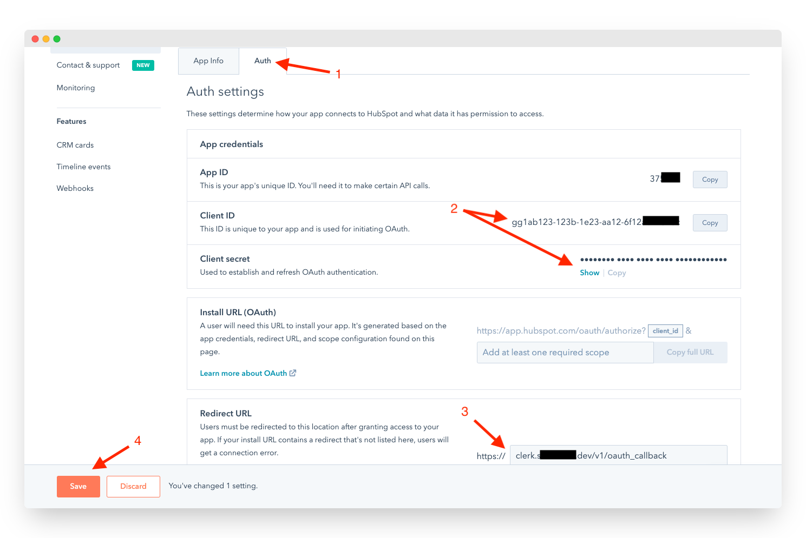

# HubSpot

## Overview

Adding social login with HubSpot to your app with Clerk is simple -  you only need to set the **Client ID**, **Client Secret** and **Authorized redirect URI** in your instance settings.

To make the development flow as smooth as possible, Clerk uses preconfigured shared OAuth credentials and redirect URIs for development instances - no other configuration is needed. 

For production instances, you will need to create your own developer account with **HubSpot** and generate your own Client ID and Client secret.


The purpose of this guide is to help you setup a HubSpot developer account and a HubSpot OAuth app - if you're looking for step-by-step instructions using Clerk to add social login \(OAuth\) to your application, follow the [Social login \(OAuth\)](../../popular-guides/social-login-oauth.md) guide.


## Before you start

* You need to create a Clerk Application in your [Clerk Dashboard](https://dashboard.clerk.dev). For more information, check out our [Setup your application](../../popular-guides/setup-your-application.md) guide.
* You need to have a HubSpot Developer account. To create one, [click here](https://app.hubspot.com/signup/developers/step/existing-user?_ga=2.145169076.1430980384.1628431607-741498900.1628431607).

## Configuring HubSpot social login

First, you need to create a new HubSpot app and enable OAuth support. Follow the official HubSpot [Creating an App](https://developers.hubspot.com/docs/api/creating-an-app) guide.

Once your app is created, click on the **Auth** tab and copy the **App Id** and Client Secret, as shown below.

Go to the [Clerk Dashboard](https://dashboard.clerk.dev), select your **Application**, ****and navigate to **Instances**  ➜  **Settings**  ****➜  **User Management** ➜ **SSO**.  Click the **Manage credentials** button under the TikTok provider, select **Custom profile** and paste the values you obtained during the previous step.

Before you close the **Manage credentials** modal, copy the **Authorized redirect URI**. Go back to the HubSpot panel and paste it into the **Redirect URL** field and click **Save**.

Don't forget to click **Apply** in the Clerk dashboard. Social login with TikTok is now configured 🔥 

## Next Steps

* Learn how to add social login with HubSpot to your Clerk application by following the [Social login \(OAuth\)](../../popular-guides/social-login-oauth.md) guide.

