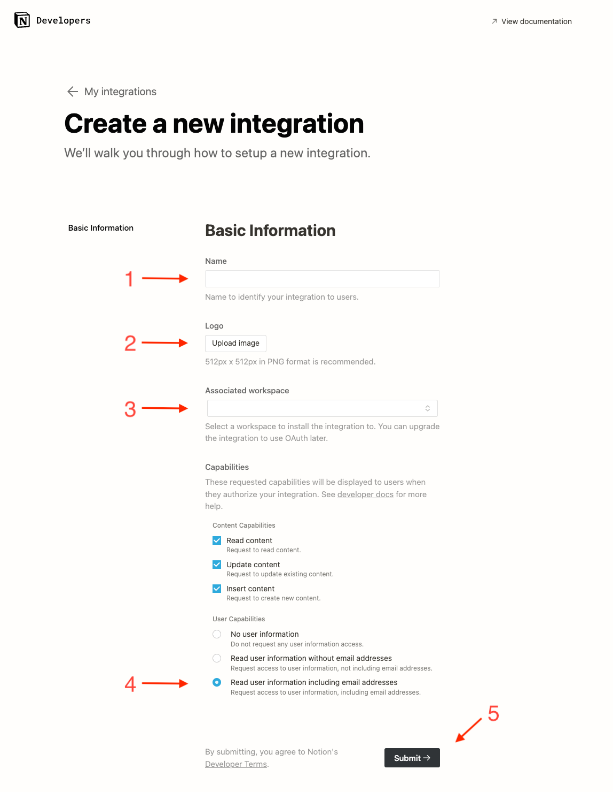
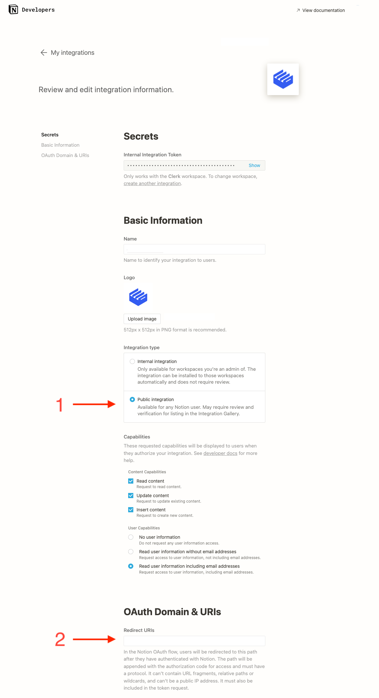
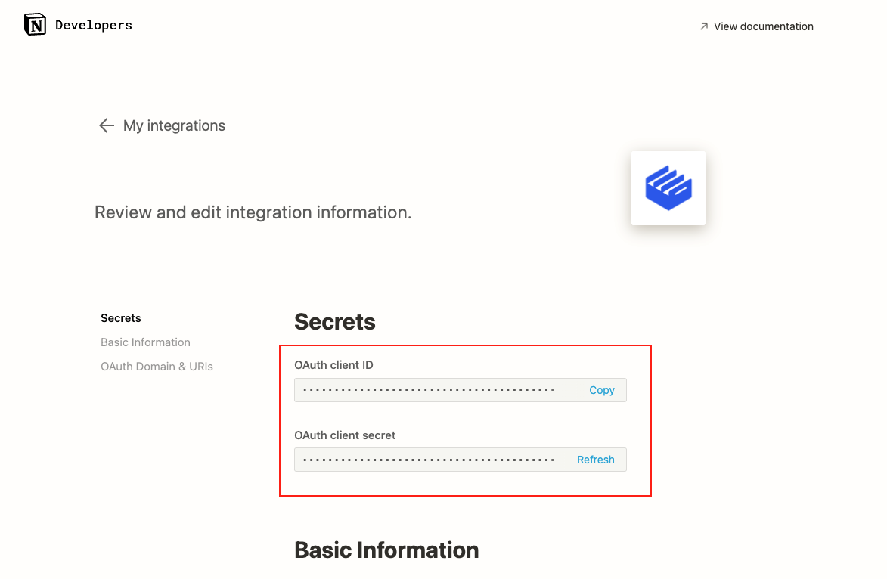

# Notion

## Overview

Adding social login with Notion to your app with Clerk is simple -  you only need to set the **Client ID**, **Client Secret** and **Authorized redirect URI** in your instance settings.

To make the development flow as smooth as possible, Clerk uses preconfigured shared OAuth credentials and redirect URIs for development instances - no other configuration is needed.&#x20;

For production instances, you will need to generate your own Client ID and Client secret using your LinkedIn account.


The purpose of this guide is to help you create a Notion developer account and a Notion OAuth app - if you're looking for step-by-step instructions using Clerk to add social login (OAuth) to your application, follow the [Social login (OAuth)](../../popular-guides/social-login-oauth.md) guide.


## Before you start

* You need to create a Clerk Application in your [Clerk Dashboard](https://dashboard.clerk.dev). For more information, check out our [Setup your application](../../popular-guides/setup-your-application.md) guide.
* You need to have a Notion developer account. To create one, [click here](https://developers.notion.com).

## Configuring Notion social login

First, you need to create a new OAuth Notion app.

You need to set a name, a logo and associate a Notion workspace with it. Make sure you are also requesting the user email address along with the other information and click Submit.

Go to the [Clerk Dashboard](https://dashboard.clerk.dev), select your application **** and instance and go to **Authentication -> Social Login**. Click the **Manage connection** button under the Notion provider, copy the **Authorized redirect URI** and paste the value into the **Redirect URIs**, as shown below, after changing the integration type to **Public**. Fill also any other information required from Notion and click Submit.

Copy the **Client ID** and **Client secret** as shown in the above image**.** Go back to the Clerk Dashboard and paste them into the respective fields.

Don't forget to click **Apply** in the Clerk dashboard. Social login with Notion is now configured 🔥
