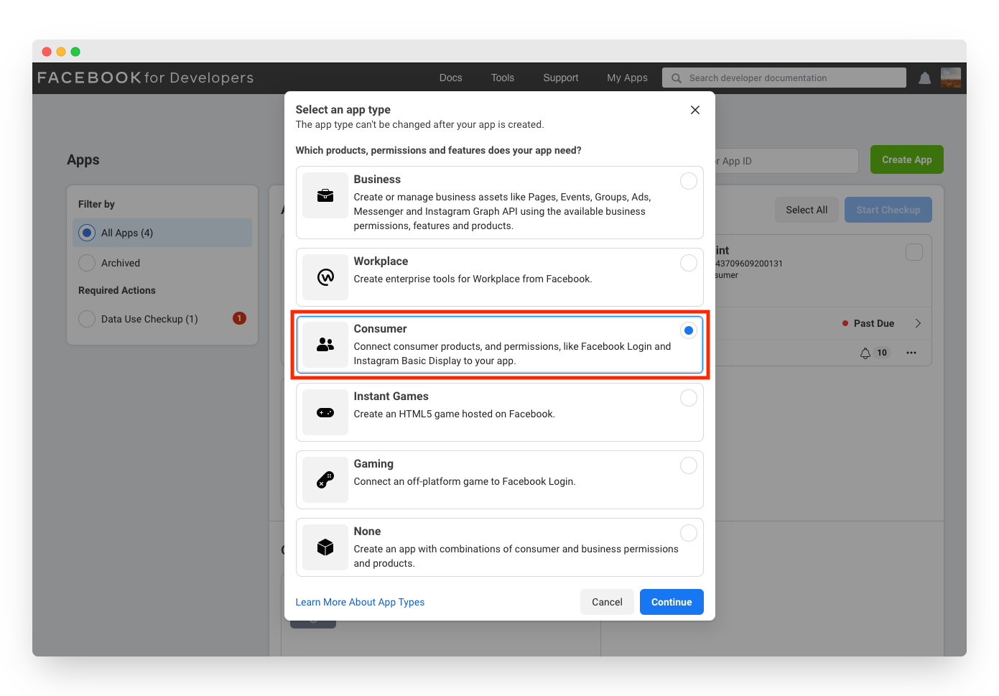
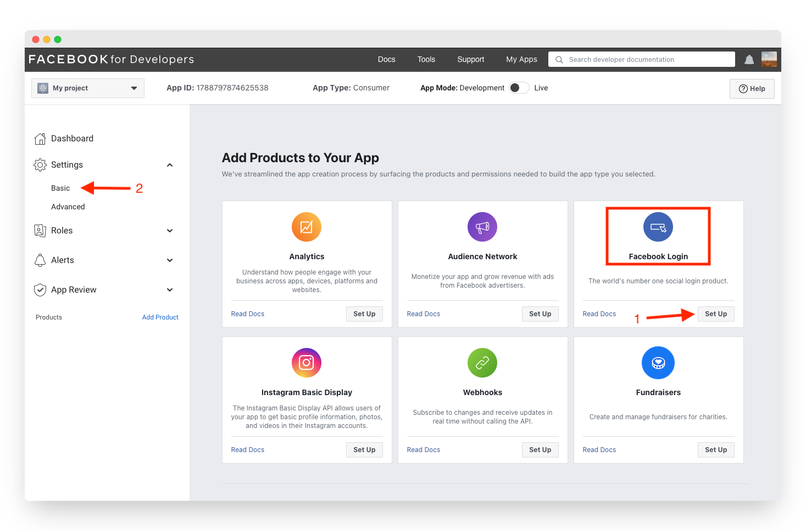
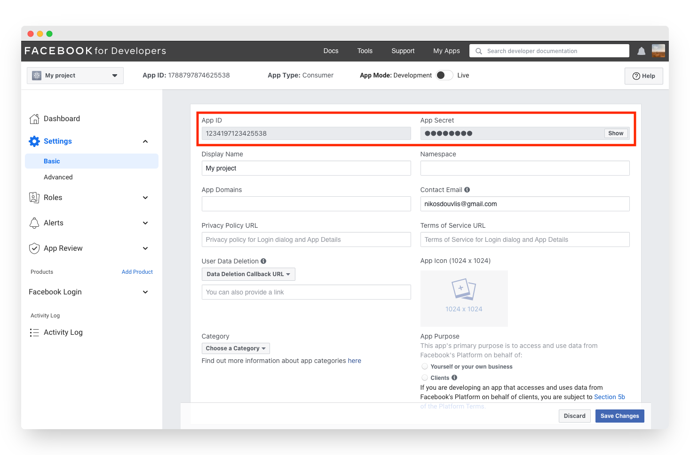
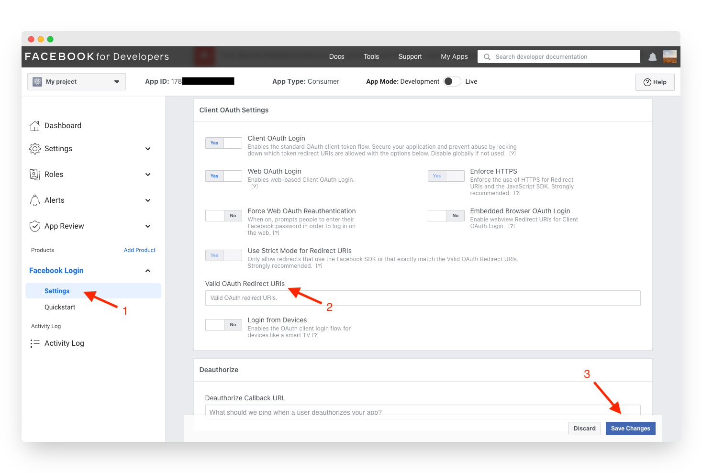

# Facebook

## Overview

Adding social login with Facebook to your app with Clerk is simple - you only need to set the **Client ID**, **Client Secret** and **Authorized redirect URI** in your instance settings.

To make the development flow as smooth as possible, Clerk uses preconfigured shared OAuth credentials and redirect URIs for development instances - no other configuration is needed.&#x20;

For production instances, you will need to create your own developer account with **Facebook **and generate your own **App ID** and **App Secret**.


The purpose of this guide is to help you setup a Facebook developer account and a Facebook OAuth2.0 project - if you're looking for step-by-step instructions using Clerk to add social login (OAuth) to your application, follow the [Social login (OAuth)](../../popular-guides/social-login-oauth.md) guide.


## Before you start

* You need to create a Clerk Application in your [Clerk Dashboard](https://dashboard.clerk.dev). For more information, check out our [Setup your application](../../popular-guides/setup-your-application.md) guide.
* You need to have a Facebook Developer account. To create one, consult the [Register as a Facebook developer](https://developers.facebook.com/docs/development/register) page.

## Configuring Facebook social login

First, you need to create a new Facebook app and enable Facebook Login. Follow the official Facebook instructions on [how to create a Facebook app](https://developers.facebook.com/docs/development/create-an-app). When asked to choose an app type, make sure you select **Consumer**. To learn more about Facebook app types, check the [Facebook App Types](https://developers.facebook.com/docs/development/create-an-app/app-dashboard/app-types) page.

At the end of the app creation wizard, you will get redirected to the app dashboard. Find the **Facebook login **card and click **Set Up**. There's no need to go through the quickstart wizard - open the **Settings** dropdown menu (sidebar) and click **Basic**, as shown in the screenshot above.

Once you have a OAuth client ID created, click on the newly created ID under **OAuth 2.0 Client IDs** and copy the **App Id** and **App Secret**.

Go to the [Clerk Dashboard](https://dashboard.clerk.dev), select your **Application**,** **and navigate to **Instances ** ➜  **Settings** ** **➜  **User Management **➜ **SSO**.  Click the **Manage credentials **button under the Facebook provider, select **Custom profile** and paste the values you obtained during the previous step.

Before you close the **Manage credentials **modal, copy the **Authorized redirect URI**. Go back to the Facebook dashboard, open the **Facebook Login** menu (sidebar) and click **Settings**.** **Paste the URI you copied before into the **Valid OAuth Redirect URIs **field. Hit **Save Changes**.

Don't forget to click **Apply **in the Clerk dashboard. Social login with Facebook is now configured 🔥&#x20;

## Next Steps

Learn how to add social login with Facebook to your Clerk application by following the [Social login (OAuth)](../../popular-guides/social-login-oauth.md) guide.
