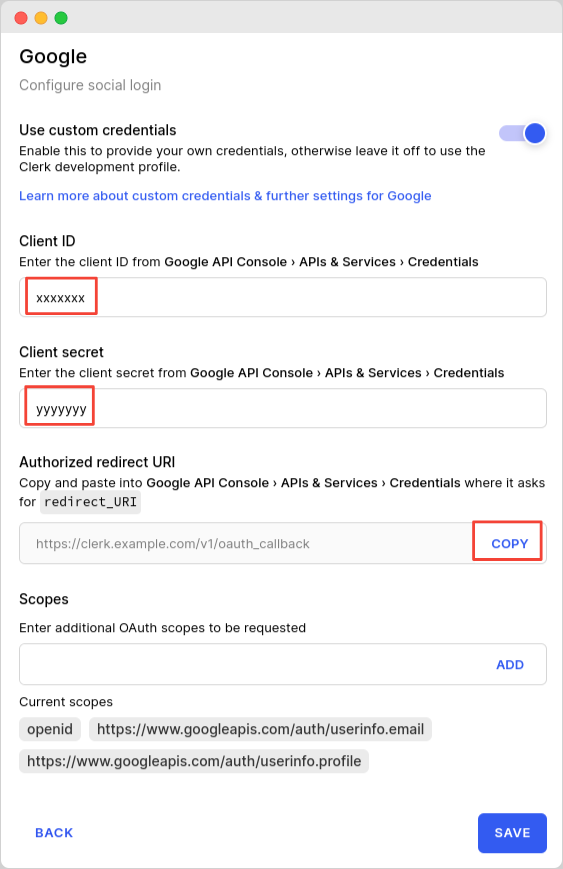

# Google

## Overview

Adding social login with Google to your app with Clerk is simple - you only need to set the **Client ID**, **Client Secret** and **Authorized redirect URI** in your instance settings.

To make the development flow as smooth as possible, Clerk uses preconfigured shared OAuth credentials and redirect URIs for development instances - no other configuration is needed.

For production instances, you will need to create your own developer account with **Google** and generate your own Client ID and Client secret.


The purpose of this guide is to help you setup a Google developer account and a Google OAuth 2.0 project - if you're looking for step-by-step instructions using Clerk to add Social Login (OAuth) to your application, follow the [Social login (OAuth)](broken-reference) guide.


## Before you start

* You need to create a Clerk Application in your [Clerk Dashboard](https://dashboard.clerk.dev). For more information, check out our [Setup your application](broken-reference) guide.
* You need to have a Google Developer account. To create one, visit the [Google Cloud console](https://console.developers.google.com).

## Configuring Google social login

First, navigate to your instance's settings in Dashboard, specifically go to **User & Authentication -> Social Login** from the left bar. From the list of OAuth vendors, enable Google. In the next window, make sure **Use custom credentials** is enabled, and copy the value of the **Authorized redirect URI** field (we'll have to paste this in Google Console in a bit). Leave that window open as we'll need to fill in the Client ID and Client Secret **** values that we'll retrieve from Google Cloud Platform console.

In a new window, go to your Google Cloud Platform console. Select your Google project (step 1 in the screenshot) and enable OAuth 2.0 support by following the official instructions on [how to setup up an OAuth 2.0 application](https://support.google.com/cloud/answer/6158849?hl=en). In the **Authorized redirect URIs** setting, paste the value you copied from Clerk's Dashboard (see previous paragraph).

Once you have a OAuth client ID created, click on the newly created ID under **OAuth 2.0 Client IDs**. Copy the values of **Your Client ID** and **Your Client secret,** they will be needed in a minute.

Back to your Clerk instance's Dashboard, in the modal we have opened (see beginning of this section) paste the **Client ID** and **Client Secret** values you obtained during the previous step.

Optionally, you can also set additional OAuth scopes that your application might need, according to your use case. More information about this feature can be found [here](https://clerk.dev/docs/how-to/social-login-oauth), while the list of Google's available scopes can be found [here](https://developers.google.com/identity/protocols/oauth2/scopes).

As a quick recap, if you followed this guide you should've done the following:

* created an OAuth client ID in Google Cloud Platform console
* added the authorized redirect URI in that OAuth client ID, as provided by Clerk Dashboard
* set the proper Client ID and Client secret values in Clerk Dashboard, as provided by the Google Cloud Platform console

In the Clerk Dashboard configuration screen, you should end up with something like this:

Finally, click **Save** so that the settings are applied. Congratulations! Social login with Google is now configured for your instance.

## References

* [https://support.google.com/cloud/answer/9110914#](https://support.google.com/cloud/answer/9110914#)

## Next Steps

Learn how to add social login with Google to your Clerk application by following the [Social login (OAuth)](broken-reference) guide.
