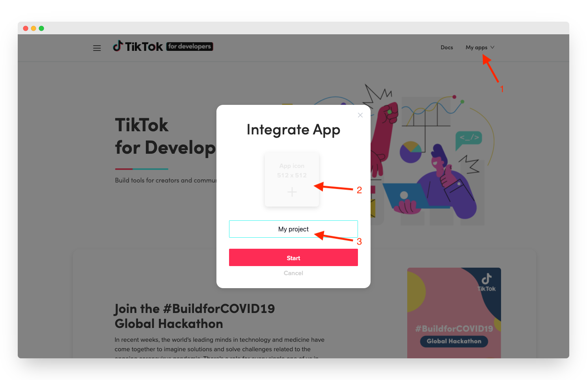
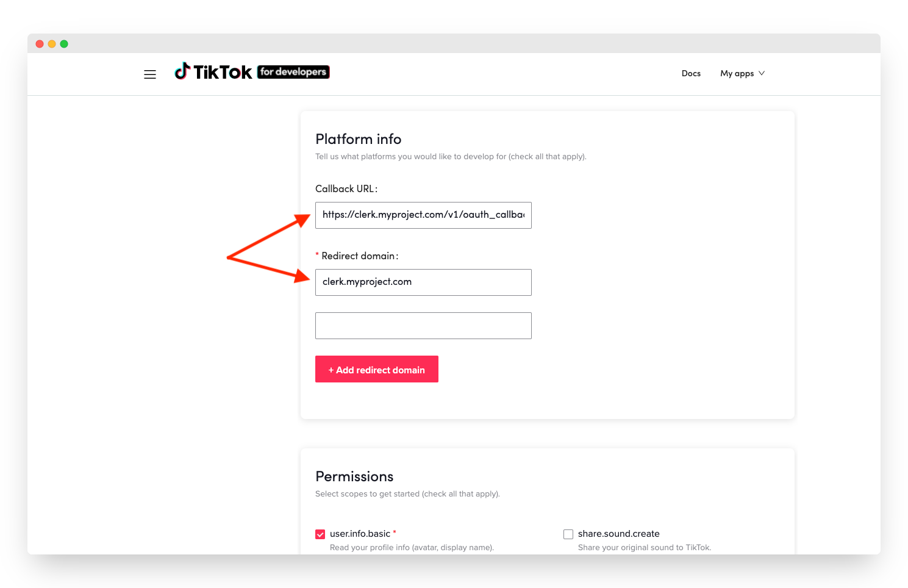
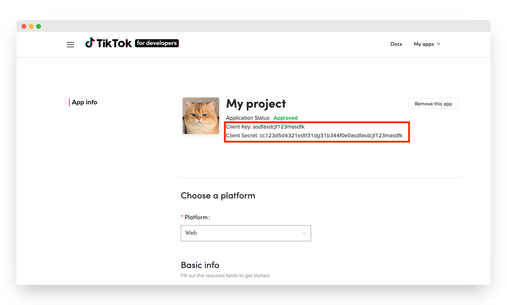

# TikTok

## Overview

Adding social login with TikTok to your app with Clerk is simple -  you only need to set the **Client ID**, **Client Secret** and **Authorized redirect URI** in your instance settings.

To make the development flow as smooth as possible, Clerk uses preconfigured shared OAuth credentials and redirect URIs for development instances - no other configuration is needed.&#x20;

For production instances, you will need to create your own developer account with **TikTok** and generate your own Client ID and Client secret.


The purpose of this guide is to help you setup a TikTok developer account and a TikTok OAuth app - if you're looking for step-by-step instructions using Clerk to add social login (OAuth) to your application, follow the [Social login (OAuth)](../../popular-guides/social-login-oauth.md) guide.


## Before you start

* You need to create a Clerk Application in your [Clerk Dashboard](https://dashboard.clerk.dev). For more information, check out our [Setup your application](../../popular-guides/setup-your-application.md) guide.
* You need to have a TikTok Developer account. To create one, visit the [TikTok for developers](https://developers.tiktok.com) page and click on Login ➜ Sign Up

## Configuring TikTok social login

First, you need to create a new TikTok app. Go to the [TikTok for developers](https://developers.tiktok.com) page, login with your developer account and create a new app by clicking on the **My Apps**  ➜  **Connect a new app**  and following the on screen wizard.

Add an icon and a name for your new project and hit **Start**.&#x20;

You'll get redirected to the app creation form. Notice that you need to fill the **Callback URL** and **Redirect domain** fields. Go to the [Social Login page](https://dashboard.clerk.dev/last-active?path=authentication/social) and enable TikTok. In the modal that opened, ensure **Use custom credentials** is enabled and copy **Authorized redirect URI**.&#x20;

Go back to the TikTok panel, paste the value into the **Callback URL** field. Copy the `clerk.[your-domain].com` part of the URL and paste it in the **Redirect domain** field. Hit **Apply** to compete the registration.


Your app needs to be reviewed by TikTok before the registration completes. Note that this might take a couple of days.


Once your app is approved, simply copy the **Client Key** and **Client Secret** from the TikTok panel, go back to the Clerk dashboard, open the **Manage credentials** modal for the TikTok provider and and paste them into the respective fields.

Don't forget to click **Apply** in the Clerk dashboard. Social login with TikTok is now configured 🔥&#x20;

## Next Steps

* Learn how to add social login with TikTok to your Clerk application by following the [Social login (OAuth)](../../popular-guides/social-login-oauth.md) guide.
