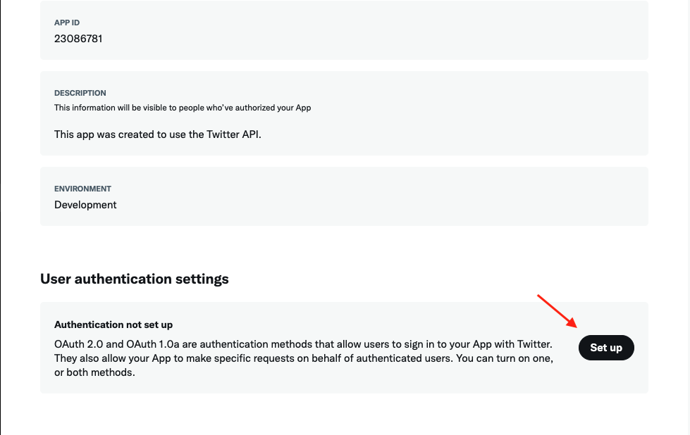

# Twitter

## Overview

Adding social login with Twitter to your app with Clerk is simple -  you only need to set the **Client ID**, **Client Secret** and **Authorized redirect URI** in your instance settings.

To make the development flow as smooth as possible, Clerk uses preconfigured shared OAuth credentials and redirect URIs for development instances - no other configuration is needed.&#x20;

For production instances, you will need to generate your own Client ID and Client Secret using your Twitter account.


The purpose of this guide is to help you create a Github account and a Github OAuth app - if you're looking for step-by-step instructions using Clerk to add social login (OAuth) to your application, follow the [Social login (OAuth)](../../popular-guides/social-login-oauth.md) guide.


## Before you start

* You need to create a Clerk Application in your [Clerk Dashboard](https://dashboard.clerk.dev). For more information, check out our [Setup your application](../../popular-guides/setup-your-application.md) guide.
* You need to have a Twitter Application set up so it can be used for Social login. If you don't have a Twitter Application, click [here](https://developer.twitter.com/en/docs/apps/overview) for instructions on how to create one. If you already have one, please go to your [Twitter app settings](https://developer.twitter.com/content/developer-twitter/en/docs/basics/developer-portal/guides/apps) and ensure that the _"Allow this app to be used to Sign in with Twitter?_” option is enabled.

## Configuring Twitter social login

If you don't have an existing Twitter Application you've set up for social login, you need to register a new one at the [Twitter Developer Portal](https://developer.twitter.com/en/portal/dashboard). Note that the process requires approval from Twitter before your new application can be used.

To do so, go to "[Projects & Apps](https://developer.twitter.com/en/portal/projects-and-apps)" and click "**+ Create App**" to create a new application. After entering a name, you'll be presented with your app's credentials; **API Key** and **API Secret**. Copy those values; we're going to use them in a while.

Go to the [Clerk Dashboard](https://dashboard.clerk.dev), select your application **** and instance and go to **Authentication -> Social Login**. Click the **Manage connection** button under the Twitter provider, select **Custom profile** and paste the **API Key** and **API Secret** values which we copied in the previous step, into the **Consumer key** and **Consumer secret** respectively. Then, copy the **Authorized redirect URI,** we're going to need it shortly after.

Navigate to your application settings screen and scroll down to the **User authentication settings** section **** and click **Set up**.

In the next screen you'll be presented with the user authentication settings. Make sure that both **OAuth 1.0a** and **Request email address from users** are enabled.

Also, enter the **Authorized Redirect URI** that we grabbed in the previous step from your Clerk instance's settings and insert it in the **Callback URI** setting. Your app's settings should like similar to the ones below. Fill any other required fields and click save. Your Twitter App is now ready.

Don't forget to click **Apply** in the Clerk dashboard. Social login with Twitter is now configured 🔥&#x20;
